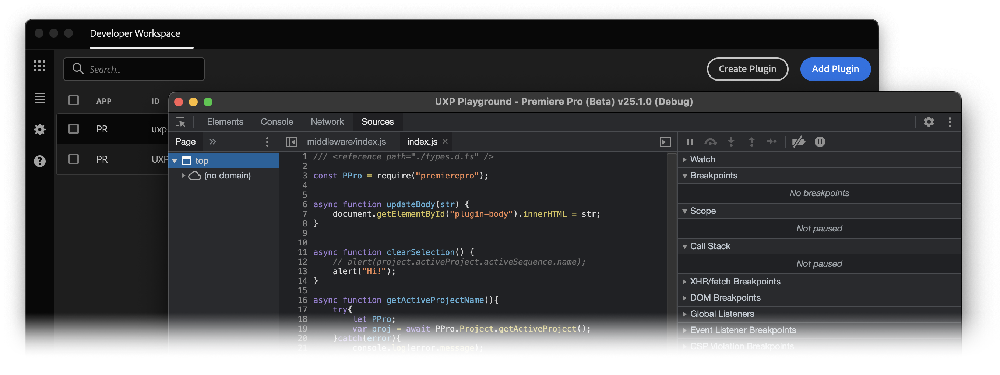

<Hero slots="heading, text" background = "rgb(200, 10, 10)"/>

# Premiere Pro UXP API

Modern extensibility powering the design of custom tools and features, allowing unparalleled workflow efficiency to be introduced into any unique Premiere Pro environments.

<Resources slots="heading, links"/>

#### Resources

- [What's new](./changelog/)
- [UXP APIs](./uxp-api/)
- [Premiere Pro DOM APIs](./ppro_reference/index.md)
- [Plugins](./plugins/getting-started/index.md)
- [Creative Cloud Developer Forums](https://forums.creativeclouddeveloper.com/)

## Overview

UXP (**U**nified E**x**tensibility **P**latform) is a scripting platform built into Premiere Pro.  It is powered by a modern JavaScript engine and offeres the ability to access many Premiere Pro functions at a programatic level.  With UXP, unique tools can be built to integrate with and optimize the most precise and demanding workflows, reducing repitition, maximizing efficiency and leveraging Premiere Pro into a bespoke application customized for the needs of any project.

Best of all, UXP Plugins run right in Premiere Pro.

Premiere Pro offers a specific set of UXP functionality that extends the base UXP API common across all UXP-capible Adobe Applications.  Documentation for both the Premiere Pro API and the base UXP API can be accessed via this site.

<DiscoverBlock slots="heading, text"/>

## Features

**Fast, Interactive Development.** Load, launch and update panels directly without having to relaunch Premiere Pro.

<DiscoverBlock slots="text"/>

**Built In Debuggger.**  Trace code quickly using the built-in debugger that attaches natively to Premiere Pro.

<DiscoverBlock slots="text"/>

**Threaded Execution.**  UXP operates in parallel with other Premiere Pro processes.  Continue working in Preimere Pro while UXP Plugin functions are running.

## Updates

The Premiere Pro UXP API, along with this documentation website, will be updated periodically to further expand functionality as new versions of Premiere Pro are released and new features are developed.

## Join the community

Join the worldwide community of Creative Cloud Developers who are building plugins and integrations to empower creativity!

Here are a few other ways to get involved:

- Join the [Creative Cloud Developer Forums](https://forums.creativeclouddeveloper.com/) to meet other developers, ask questions, and offer help.
- Subscribe to the [Adobe Creative Cloud Developer Newsletter](https://www.adobe.com/subscription/ccdevnewsletter.html).

<!-- ## Discover

<DiscoverBlock width="100%" slots="heading, link, text"/>

### Get Started

[Quickstart Guide](guides/)

Get started with the Cat Analytics APIs.

<DiscoverBlock slots="heading, link, text"/>

### Guides

[Calculated Metrics API](guides/dummy_metrics_api/)

Returns information on the user's company that is necessary for making other Cat Analytics API calls.

<DiscoverBlock slots="link, text"/>

[Segments API](guides/dummy_oauth_client/)

Provides configuration guidance and best practices for the /segments endpoint.

<DiscoverBlock slots="link, text"/>

[Reporting Guide API](guides/dummy_using_postman/)

Provides configuration guidance and best practices for the /reports endpoint.

<DiscoverBlock slots="link, text"/>

[Migrating from 1.4 to 2.0](guides/migrating/)

For help migrating from the 1.4 versions of the Analytics API to the newer and more capable /reports API.

<DiscoverBlock width="100%" slots="heading, link, text"/>

### API References

[Try the API](api/)

Try the Analytics API with Swagger UI. Explore, make calls, with full endpoint descriptions.

## Contributing

We encourage you to participate in our open documentation initiative, if you have suggestions, corrections, additions
or deletions for this documentation, check out the source from [this github repo](https://github.com/adobe/gatsby-theme-spectrum-example), and submit a pull
request with your contribution. For more information, refer to the [contributing page](support/contribute/).

## API Requests & Rate Limits

The timeout for API requests through adobe.io is currently *60 seconds*.

The default rate limit for an Cat Analytics Company is *120 requests per minute*. (The limit is enforced as *12 requests every 6 seconds*).
When rate limiting is being enforced you will get `429` HTTP response codes with the following response body: `{"error_code":"429050","message":"Too many requests"}`. -->