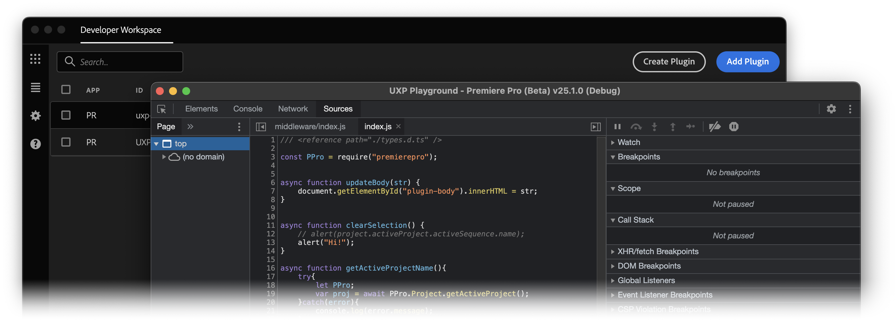

<Hero slots="heading, text" background = "rgb(200, 10, 10)"/>

# Premiere UXP API

A modern extensibility platform for building Custom Tools and Features that streamline workflows in any unique Premiere environment.

<Resources slots="heading, links"/>

#### Resources

- [What's new](./changelog/index.md)
- [UXP Plugins](./plugins/index.md)
- [Share & Distribute](./plugins/distribution/overview/index.md)
- [UXP APIs](./uxp-api/index.md)
- [Premiere DOM APIs](./ppro_reference/index.md)
- [Developer Forums](https://forums.creativeclouddeveloper.com/)

## Overview

UXP (**U**nified e**X**tensibility **P**latform) is an integration framework built into Premiere and other Adobe Creative Cloud applications. It is powered by a modern JavaScript engine and offers the ability to access many Premiere functions at a programmatic level. With UXP, you can build unique tools that integrate with and optimize the most precise, demanding workflows. These tools reduce repetition, maximize efficiency, and transform Premiere into a bespoke application tailored to the needs of any project.

Premiere adds its own APIs on top of the base UXP functionality. This website provides documentation for both APIs.

## Get Started

<DiscoverBlock slots="heading, link, text"/>

### New to UXP?

[Introduction & Setup](./introduction/index.md)

Learn the essentials, set up your development environment, and understand the technical stack.

<DiscoverBlock slots="link, text"/>

[Build Your First Plugin](./plugins/index.md)

Step-by-step tutorials for creating panels, commands, and modal dialogs.

<DiscoverBlock slots="heading, link, text"/>

### Building Plugins

[Plugin Concepts](./plugins/concepts/index.md)

Understand manifests, entrypoints, panels, and how plugins work.

<DiscoverBlock slots="link, text"/>

[Tutorials](./plugins/tutorials/index.md)

Hands-on guides for adding panels, commands, lifecycle hooks, and more.

<DiscoverBlock slots="link, text"/>

[Hybrid Plugins](./plugins/concepts/hybrid-plugins/index.md)

Extend your plugins with high-performance C++ native libraries.

<DiscoverBlock slots="link, text"/>

[Code Recipes](./resources/recipes/index.md)

Practical examples for common tasks like filesystem operations, network requests, and styling.

<DiscoverBlock slots="heading, link, text"/>

### API References

[Premiere DOM API](./ppro_reference/index.md)

Access sequences, tracks, clips, markers, project items, and application settings.

<DiscoverBlock slots="link, text"/>

[UXP JavaScript API](./uxp-api/reference-js/index.md)

File system, networking, shell execution, and core UXP functionality.

<DiscoverBlock slots="link, text"/>

[UI Components (Spectrum)](./uxp-api/reference-spectrum/index.md)

Adobe's design system components for building plugin interfaces.

<DiscoverBlock slots="link, text"/>

[HTML & CSS References](./uxp-api/index.md)

Supported HTML elements and CSS properties in UXP.

## Additional Resources

- **[Share & Distribute](./plugins/distribution/overview/index.md)**: learn about packaging, Adobe Marketplace, enterprise distribution, and installation options.
- **[FAQ](./resources/faq/index.md)**: common questions and troubleshooting
- **[Starters & Samples](./resources/starters-samples/index.md)**: template projects to jumpstart development
- **[What's New](./changelog/index.md)**: latest API updates and changes

## Join the community

Join the worldwide community of Creative Cloud Developers who are building plugins and integrations to empower creativity!

Here are a few other ways to get involved:

- Join the [Creative Cloud Developer Forums](https://forums.creativeclouddeveloper.com/) to meet other developers, ask questions, and offer help.
- Subscribe to the [Adobe Creative Cloud Developer Newsletter](https://www.adobe.com/subscription/ccdevnewsletter.html).

  
