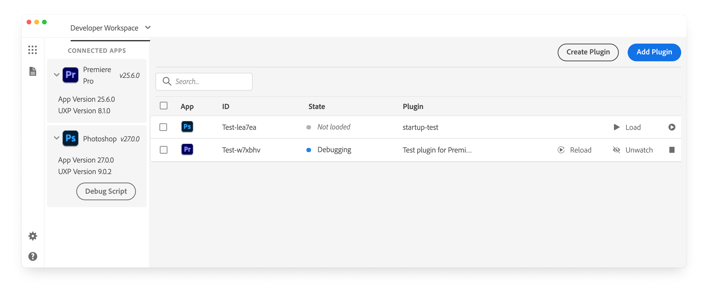
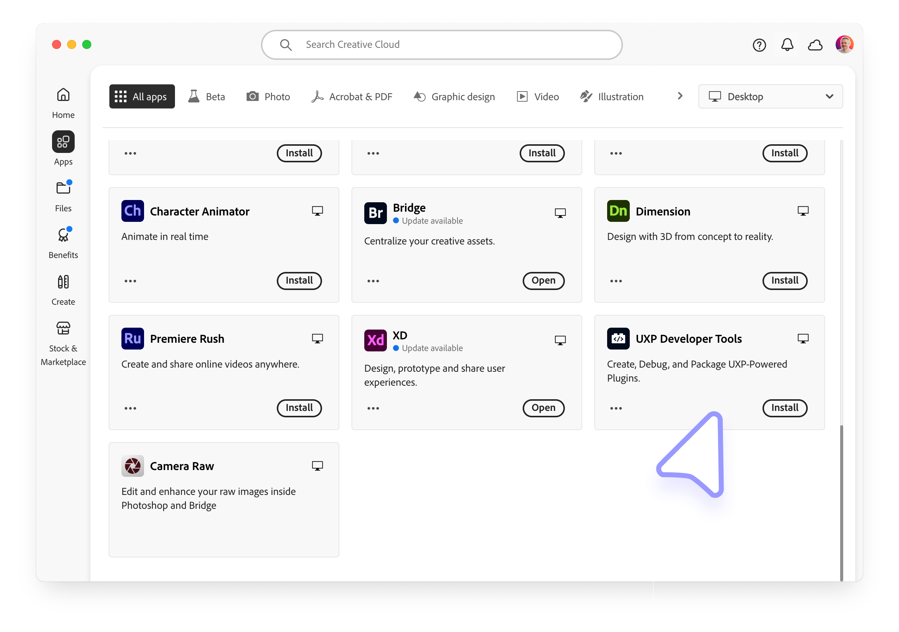
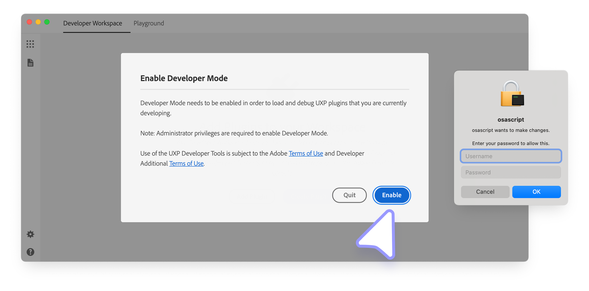

# Essential Development Tools for UXP

Let's explore the essential tools to start building UXP plugins

## Code Editor

A reliable Code Editor helps you stay organized and productive. Any modern editor will work, but [Visual Studio Code](https://code.visualstudio.com) is a popular choice thanks to its strong ecosystem, extensions for formatting and linting, and seamless integration with UXP-related workflows. [Cursor](https://www.cursor.com/) is also a great option for developers who prefer a more AI-driven development experience.

## UXP Developer Tool (UDT)

The UXP Developer Tool (UDT) simplifies the process of creating, loading, managing, and debugging plugins for Adobe's UXP-powered applications. UXP plugins are supported in **Premiere Pro v25.6** and later since **UDT v2.2**.



In addition, the UXP Developer Tool:

- Includes a **Code Playground** to quickly test and explore APIs.
- Lets you **package plugins** into a `.ccx` [installable file](../../../plugins/distribution/package/index.md), ready for distribution.
- Provides **Starter Templates** and Sample Projects to help you get moving faster

<InlineAlert variant="info" slots="header,text"/>

Admin privileges are required to use UDT.

The UXP Developer Tool requires administrator-level privileges to run correctly. If you cannot elevate permissions on your system, you may not be able to use this tool.

### Installation

You can install UDT directly [from Creative Cloud](https://creativecloud.adobe.com/apps/download/uxp-developer-tools) or by following these steps:

1. Open the Adobe Creative Cloud desktop app. If you don't have it installed, [download and install it here](https://creativecloud.adobe.com/apps/download/creative-cloud).
2. Sign in with your Adobe ID if you haven't already.
3. Go to the **All apps** section, where you'll find "UXP Developer Tools" listed; type "UXP Developer Tools" in the search bar for easier access.
4. Click **Install** on the UXP Developer Tools card to begin installation.
   

<InlineAlert variant="warning" slots="text"/>

The UXP Developer Tool is not yet available as a Package in the Adobe **Admin Console** for Team and Enterprise customers.

### First launch

When you launch the Developer Tool for the first time, you'll be prompted to enable Developer Mode. This is required for you to load plugins in development into the application. Once you click **Enable**, elevated permissions will be requested, and you may be required to enter your password or approve an action from the Developer Tool.



If you have problems with this step, you can also configure Developer Mode manually, although you must have Administrative privileges to do so.

1. Quit the UXP Developer Tool
2. Navigate to `/Library/Application Support/Adobe/UXP/Developer` on macOS, or `%CommonProgramFiles%/Adobe/UXP/Developer` on Windows. If the folder does not exist, you can create it—you'll need administrative rights.
3. Create a new file named `settings.json` with the following content—you'll need administrative rights to save the file:

   ```json
   { "developer" : true }
   ```

4. Launch the UXP Developer Tool again.

For now, successfully installing UDT is sufficient. We will understand UDT in more depth once you build your first plugin.

<!--
TODO Add this section once details are available
## Type definitions
Provide download link for UXP and Premiere Pro
-->
