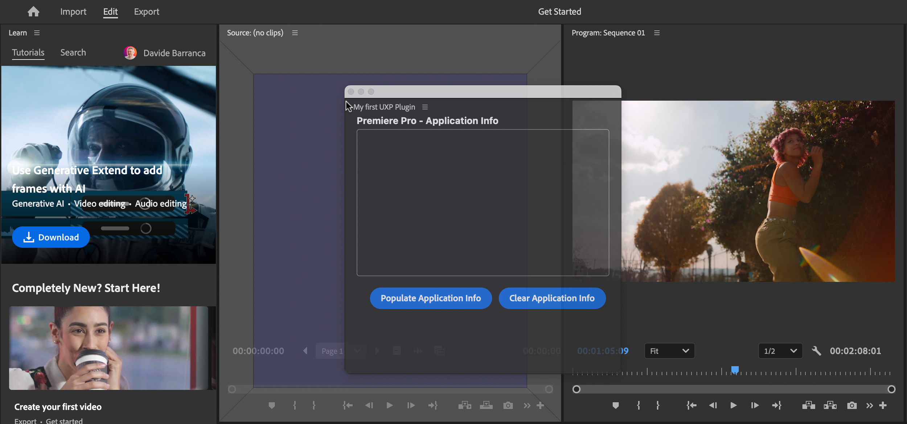
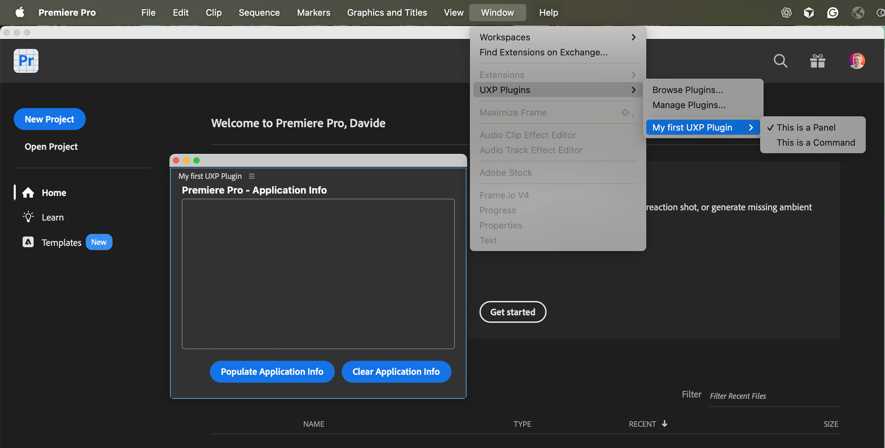

# UXP Entrypoints

Learn how UXP plugins connect commands and panels to Premiere Pro

## Commands and Panels

A UXP plugin is a self-contained application that is hosted in Premiere Pro; it can be made of two different components:

- **Commands**:
  - Execute a specific piece of code when invoked via menu item.
  - Can optionally show a modal dialog UI.
- **Panels**:
  - Have a persistent, non blocking User Interface and lifecycle hooks.
  - Can optionally show an additional, modal dialog UI.

<InlineAlert variant="info" slots="header, text" />

#### Modal dialogs

These are a special type of floating windows that **block the user** from interacting with the rest of the application **until the dialog is closed**. Modal dialogs are generally employed to get input data, confirm an action, or show a message.

**Commands** are mostly used to perform a specific task and then exit; for example, applying a preset transition to the current clip (with or without an input dialog).

**Panels** are mostly used to provide a persistent UI for the user to interact with throughout the work session like any other Premiere Pro built-in panels. Both have access to the host application's APIs to perform complex tasks. **To dock a panel, drag it from the title bar**—not the window frame bar—until the following overlay is shown.



A UXP plugin can **include commands, panels, or both—and may define multiple instances of each**. For example, an individual plugin can be made of:

- One panel (no commands)
- One command (no panels)
- One panel and one command
- Three panels and four commands, etc.

Both commands and panels are entries of their respective plugin in the **Window** > **UXP Plugins** menu.



## Entrypoints

In UXP, an entrypoint is a specific way for the host application to invoke one of the plugin's components—commands or panels. You can think of it as a contract made of two different parts:

- A **Manifest file** that declares the number and type of entrypoints the plugin provides.
- Your **JavaScript code** which handles the calls via `entrypoints.setup()` and maps the entrypoint ID to the corresponding implementation code.

### Manifest declaration

The `manifest.json` file is located at the root of the plugin bundle that contains all sorts of metadata about the plugin. Among all its properties, documented in [this reference guide](../manifest/index.md), Entrypoints are—unsurprisingly—declared in the required `entrypoints` array.

```json
{
  "manifestVersion": 5,
  "id": "test1234",
  "name": "Test Plugin",
  "version": "1.0.0",
  "host": { "app": "premierepro", "minVersion": "25.6.0" },
  "main": "index.html",
  "entrypoints": [                                  // 👈
      {                                             // 👈
          "type": "command",                        // 👈
          "id": "firstCommand",                     // 👈
          "label": { "default": "Run a Function" }  // 👈
      },                                            // 👈
      {                                             // 👈
          "type": "panel",                          // 👈
          "id": "firstPanel",                       // 👈
          "label": { "default": "First Panel" }     // 👈
      }                                             // 👈
  ],                                                // 👈
}
```

At least one entrypoint of type [`entrypointDefinition`](../manifest/index.md#entrypointdefinition) must be declared in the Manifest.

### Code implementation

Your JavaScript code (for example, in the `index.js` file) handles the calls each time the host application invokes one of the Entrypoints. From the `uxp` module, you can access the `entrypoints` object, whose `setup()` method is what we'll focus on in the remainder of this guide.

```js
const { entrypoints } = require("uxp");
entrypoints.setup({ /* ... */ });
```

## The `entrypoints.setup()` method

Although the implementation of the `entrypoints.setup()` method is optional, you are strongly encouraged to provide it. It will:

1. Define **lifecycle hooks at a Plugin** level.
2. Define **lifecycle hooks at a Panel** level.
3. Allow the creation of **flyout menus** and hook up the respective handlers for each Panel entrypoint.
4. Define **handlers for each Command** entrypoint.

<InlineAlert variant="info" slots="header, text, text2" />

Lifecycle hooks

These are callback functions that are automatically invoked when specific events occur during the lifecycle of a Plugin or a Panel; they are optional and can be used to perform, for example, any setup or teardown logic.

Since Manifest version 5, most lifecycle **handlers may be asynchronous** and return a [Promise](https://developer.mozilla.org/en-US/docs/Web/JavaScript/Reference/Global_Objects/Promise)—see [Using Promises](#using-promises) below for an example.

### Plugin Lifecycle Hooks

UXP provides two lifecycle hooks at a Plugin level, respectively invoked when the plugin container itself is created and destroyed: `create()` and `destroy()`. You define them in the `plugin` property of the object passed to the `entrypoints.setup()` method.

```js
const { entrypoints } = require("uxp");
entrypoints.setup({
  plugin: {
    create()  { console.log("Plugin created");   },
    destroy() { console.log("Plugin destroyed"); }
  },
});
```

### Panel Lifecycle Hooks

At a panel level, you have access to more lifecycle hooks: `create()`, `show()`, `hide()`, and `destroy()`.

You define them in the `panels` property of the object passed to `entrypoints.setup()`.
This object must include one property for each `"panel"` entrypoint declared in the `manifest.json`, using the panel IDs as property names.

```js
const { entrypoints } = require("uxp");
entrypoints.setup({
  panels: {
    firstPanel: {  // 👈 must match the id of the entrypoint
                   //    of type "panel" from manifest.json
      create(rootNode)  { console.log("Panel created"); },
      show(rootNode)    { console.log("Panel shown"); },
      hide(rootNode)    { console.log("Panel hidden"); },
      destroy(rootNode) { console.log("Panel destroyed"); }
    },
    secondPanel: { /*...*/ }, // 👈  add properties for each additional
                              //    "panel" entrypoint in manifest.json
  }
});
```

<InlineAlert variant="warning" slots="text" />

The `hide()` and `destroy()` hooks are **not working as expected yet** in Premiere Pro. This will be fixed in a future update.

Panel handlers receive a `rootNode` parameter; it's the HTML document root node, which can be used to programmatically append or remove an appropriate container element in a multiple panels scenario.

### Command Handlers

Command handlers are functions that are invoked when a command entrypoint is invoked via click to Premiere Pro **Window** > **UXP Plugins** > **`<your plugin name>`** > **`<your command name>`**.

They are defined in the `commands` property of the object passed to `entrypoints.setup()`, which must include one property for each `"command"` entrypoint declared in the `manifest.json`, using the command IDs as property names.

```js
const { entrypoints } = require("uxp");

const commandHandler = (evt) => {
  console.log(
    "Command handler invoked!", evt.type // uxpcommand
  );
};

entrypoints.setup({
  commands: {
    firstCommand: commandHandler, // 👈 must match the id of the
                                  // entrypoint of type "command"
                                  // from manifest.json
  }
});
```

The handler function receives a single event parameter of type `uxpcommand`. It can be listened to at the `<body>` element level, if needed.

```javascript
document.body.addEventListner("uxpcommand" (event) => { /* ... */ });
```

## Using Promises

Promise support in UXP entrypoints is enabled for.

- **Plugins**: `destroy()`.
- **Panels**: `create()`, `show()`, `destroy()`, `hide()`.

Currently, the `show()` hook is tied to the `create()` hook, and the `hide()` hook is tied to `destroy()`. All methods have a timeout of 300 milliseconds.

```javascript
const { entrypoints } = require("uxp");
entrypoints.setup({
  plugin: {
    create() {
      console.log("Plugin create hook");
    },
    destroy() {
      return new Promise(function (resolve, reject) {
        console.log("Plugin destroy hook");
        resolve();
      });
    },
  },
  panels: {
    firstPanel: {
      create(rootNode) {
        return new Promise(function (resolve, reject) {
          console.log("Panel create hook", rootNode);
          resolve();
        });
      },
      show(rootNode, data) {
        return new Promise(function (resolve, reject) {
          console.log("Panel show hook", data);
          resolve();
        });
      },
      hide(rootNode, data) {
        return new Promise(function (resolve, reject) {
          console.log("Panel hide hook", data);
          resolve();
        });
      },
      destroy(rootNode) {
        return new Promise(function (resolve, reject) {
          console.log("Panel destroy hook", rootNode);
          resolve();
        });
      },
    },
  },
  commands: {
    firstCommand: commandHandler,
  },
});
```
