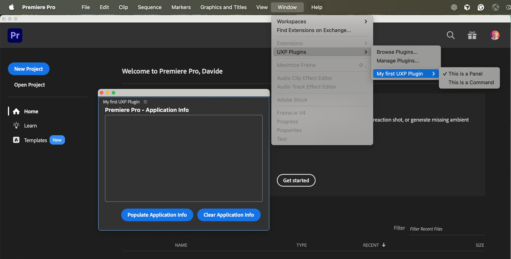

# Panels and Commands

Learn the fundamental differences between the two types of UXP plugin components and when to use each.

## Overview

A UXP plugin is a self-contained application hosted in Premiere Pro. Every plugin is built using one or both of two component types: **Panels** and **Commands**. Understanding the differences between these components is essential for designing plugins that fit naturally into users' workflows.

Think of it this way: **Commands are actions**, while **Panels are workspaces**. Commands execute tasks and close; Panels provide ongoing interfaces that stay open alongside Premiere Pro's built-in panels.

## Commands

Commands are **menu items that execute code when clicked**. They appear in the **Window** > **UXP Plugins** menu and are designed for discrete tasks that don't require a persistent interface.

### Characteristics of Commands

- **Execute and exit**: commands run their code and finish—there's no persistent UI.
- **Optional modal dialogs**: commands can display a [modal dialog](#modal-dialogs) to gather input or show results, but the dialog blocks user interaction with Premiere Pro until dismissed.
- **Lightweight**: ideal for simple, focused tasks that don't need ongoing user interaction.
- **No lifecycle persistence**: commands don't stay "running" in the background—they execute when invoked and complete when done.

### When to Use Commands

Choose Commands when you need to:

- **Automate a specific task**: apply a preset, export a file, or perform a calculation.
- **Execute a one-time action**: convert clip metadata, rename sequences, or generate a report.
- **Provide quick utilities**: show plugin information (About dialog), open documentation, or perform system checks.
- **Simplify the UI**: when a task doesn't need ongoing interaction, a Command keeps the Premiere Pro workspace uncluttered.

## Panels

Panels are **persistent user interfaces** that users can dock into the Premiere Pro workspace alongside built-in panels like the Timeline or Effect Controls. They remain open and interactive throughout the work session.

To dock a panel, drag it from the title bar—not the window frame bar—until the docking overlay appears:

### Characteristics of Panels

- **Persistent UI**: panels stay open and accessible, maintaining their state between uses.
- **Non-blocking**: users can interact with both the panel and Premiere Pro simultaneously.
- **Dockable and flexible**: panels can be docked, floated, resized, and arranged like any native Premiere Pro panel.
- **Lifecycle hooks**: panels have `create()`, `show()`, `hide()`, and `destroy()` hooks for managing their state.
- **Optional modal dialogs**: like Commands, Panels can also launch modal dialogs for focused input or confirmation.

### When to Use Panels

Choose Panels when you need to:

- **Provide continuous interaction**: display controls, settings, or visualizations that users reference throughout their session.
- **Offer complex workflows**: present multi-step processes or rich interfaces with tabs, lists, or forms.
- **Integrate with workspace**: give users a tool they can position and resize to fit their preferred layout.

## Key Differences

Here's a quick comparison to help you choose:

| Aspect               | Commands                               | Panels                                 |
| :------------------- | :------------------------------------- | :------------------------------------- |
| **UI Presence**      | No persistent UI (optional modal only) | Persistent, dockable UI                |
| **User Interaction** | Blocking (if modal dialog is shown)    | Non-blocking                           |
| **Lifecycle**        | Execute and complete                   | Remain open with lifecycle hooks       |
| **Best For**         | One-time actions, automation           | Ongoing interaction, complex workflows |
| **Complexity**       | Lightweight, focused tasks             | Rich interfaces with multiple controls |

## Modal Dialogs

Both Commands and Panels can display **modal dialogs**—temporary windows that block interaction with Premiere Pro until dismissed. Modal dialogs are perfect for:

- **Gathering input**: Ask for file paths, dimensions, or configuration options.
- **Confirming actions**: "Are you sure you want to delete?"
- **Displaying results**: Show completion messages, errors, or summary information.
- **Focused workflows**: Guide users through multi-step processes that require attention.

<InlineAlert variant="info" slots="header, text" />

Modal Dialogs

Modal dialogs are **blocking by design**—users cannot interact with Premiere Pro until the dialog is closed. This makes them ideal for critical decisions or required input, but use them sparingly to avoid disrupting workflows.

### Commands with Modal Dialogs

Commands often use modal dialogs as their **primary interface**. Since Commands don't have a persistent UI, a modal dialog provides the necessary input mechanism. For example:

- An "Export Project Summary" Command might show a dialog to select output format and destination.
- An "About" Command displays plugin information in a modal dialog.

### Panels with Modal Dialogs

Panels use modal dialogs for **secondary interactions** that require focused attention. The panel provides the main interface, while modal dialogs handle specific tasks. For example:

- A "Settings" button in a panel opens a modal dialog to configure preferences.
- A "Confirm Delete" dialog appears when users click a destructive action in the panel.

## Combining Commands and Panels

A single plugin can include **multiple Commands, multiple Panels, or both**. This flexibility lets you design plugins that match user needs:

- **Panel + Commands**: A main panel for ongoing work, plus Commands for quick utilities or batch operations.
- **Multiple Panels**: Separate panels for different features (e.g., a control panel and a preview panel).
- **Multiple Commands**: A suite of related automation tasks grouped under one plugin.

All Commands and Panels from the same plugin appear under that plugin's submenu in **Window** > **UXP Plugins**.

## Implementation

This guide covers the conceptual differences between Panels and Commands. For implementation details, see:

- **[Entrypoints Guide](../entrypoints/index.md)**: Learn how to declare and implement both Panels and Commands.
- **[Add a Command Tutorial](../../tutorials/add-commands/index.md)**: Step-by-step instructions for creating Commands.
- **[Add Multiple Panels Tutorial](../../tutorials/add-panels/index.md)**: Build plugins with multiple Panel entrypoints.
- **[Add Modal Dialogs Tutorial](../../tutorials/add-modal-dialogs/index.md)**: Create modal dialogs for both Commands and Panels.

## Summary

**Commands** execute discrete tasks with optional modal dialogs—perfect for automation and one-time actions. **Panels** provide persistent, dockable interfaces for ongoing interaction and complex workflows. Both can display modal dialogs for focused input or confirmation.

Choose the component type that best fits your plugin's purpose, or combine both to create flexible, powerful tools for Premiere Pro users.
