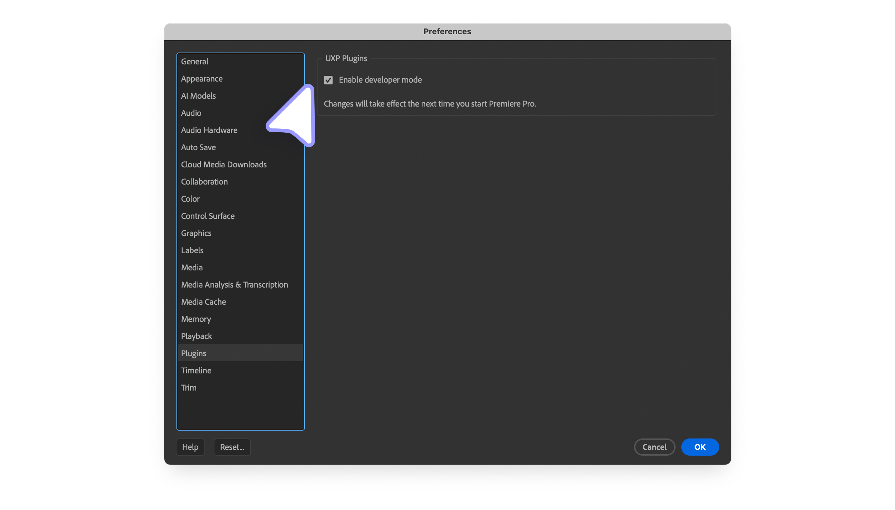

# Building your first UXP plugin

This tutorial will walk you through building your very first UXP plugin. You will learn to scaffold one from an existing template, customize it, and run it in Premiere Pro.

## Prerequisites

Before you start, make sure you have the following software installed on your machine:

- [**Premiere Pro (v25.6)**](https://creativecloud.adobe.com/apps/download/premiere-pro) or later.
- [**UXP Developer Tool (v2.2)**](https://creativecloud.adobe.com/apps/download/.uxp-developer-tools) or later.
- A **Code Editor** of your choice—for example, [Visual Studio Code](https://code.visualstudio.com/) or [Cursor](https://www.cursor.com/).

Premiere Pro's Developer Mode should be enabled. Open the **Settings** menu, select the **Plugins** tab and select the **Enable developer mode** checkbox. You will need to restart Premiere Pro for the changes to take effect.



## Development Workflow

### 1. Scaffold your Plugin

The [UXP Developer Tool](../introduction/essentials/dev-tools/index.md#uxp-developer-tool-udt) (UDT) provides a quick way to scaffold your plugin project from a set of starter templates. Open the UDT and click **Create Plugin**.


A dialog appears, allowing you to set the project details:


Please enter the following information:

| Field                        | Value                     |
| ---------------------------- | ------------------------- |
| **Name**                     | My first UXP Plugin       |
| **Plugin ID**                | _Leave it as is_          |
| **Host Application**         | Adobe Premiere Pro        |
| **Host Application Version** | 25.6                      |
| **Template**                 | premierepro-quick-starter |

Then click **Select Folder** and choose a location on your computer where you want to scaffold the plugin. The UXP Developer Tool will create a new folder named after the Plugin ID in the desired location. The folder will contain the following files:

```json
Test-fm0dom
├── manifest.json     🔧 Plugin configuration
├── index.html        🌐 User Interface
├── index.js          💻 Logic
└── README.md         📝 Documentation
```

### 2. Test in Premiere Pro

Now that you have scaffolded your plugin, you can load it in Premiere Pro. Make sure the application is running and the UXP Developer Tool is connected to it; it should appear in the left pane.

In UDT, click **Load & Watch** in your plugin's row:


This shortcut is for the **Load** and **Watch** actions, which you can perform separately. The result will be the same; the plugin will be loaded in Premiere Pro, and UDT will watch for changes in the plugin's source code and reload it automatically.


<InlineAlert slots="text" />

If you have closed the plugin, you can always show it again from Premiere Pro's **Window** > **UXP Plugins** menu.

### 3. Edit the plugin's UI

Now that your plugin is running in Premiere Pro, let's make it your own. Open the `index.html` file in your code editor. This file contains the HTML code that defines the visual content of your plugin's panel.

```html
<!DOCTYPE html>
<html>
  <head>
    <script src="main.js"></script>
    <link rel="stylesheet" href="style.css" />
  </head>
  <body>
    <h4>Application Info</h4>
    <div class="main-div">
      <sp-body id="plugin-body"> </sp-body>
    </div>
    <footer>
      <sp-button id="btnPopulate">Populate Application Info</sp-button>
      <sp-button id="clear-btn">Clear Application Info</sp-button>
    </footer>
  </body>
</html>
```

Let's change the heading to something slightly different:

```html
<body>
  <h4>Premiere Pro - Application Info</h4>
```

Thanks to the Watch & Reload feature, the changes will be automatically reflected in the host application—see the new heading in the plugin's panel below.


<InlineAlert slots="header, text" />

Manifest changes

If you make any changes to the `manifest.json` file, you must manually unload and reload the plugin. In the UXP Developer Tool, in the row for your plugin, click **Unload** and then **Load & Watch** once more.

### 4. Test the plugin's logic

Now let's check what this UXP plugin can do. Open a sample project in Premiere Pro; if you don't have one, go to the **Window** > **Learn** menu and download a sample from the **Tutorials** section.

Now click the **Populate Application Info** button in the plugin's panel.


The plugin will fetch the active project and sequence information and display it in the panel. The implementation lives in the `index.js` file, and it uses the [Premiere Pro APIs](../ppro_reference/index.md) to fetch the information. You can open the file and explore the code to see how it works.

## Next steps

Congratulations! You have successfully created your first plugin. Next, we'll take a look at some of the concepts that are important for UXP plugin development.
