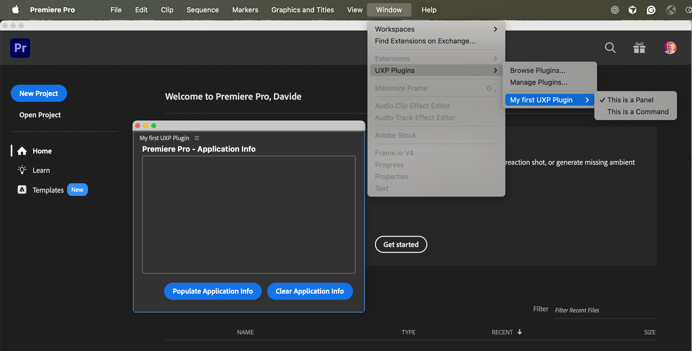

# Add a Command Entrypoint

Commands allow you to add a menu item directly to the Premiere Pro user interface.

## Overview

As we have seen in the [Panels & Commands](../../concepts/panels-and-commands/index.md) guide, commands can run any type of code, and even spin up a [modal dialog UI](../../concepts/panels-and-commands/index.md#modal-dialogs) if necessary.

They belong to their respective plugin in the **Window** > **UXP Plugins** menu.



Adding a new command is a multi-step process.

## 1. Register a new Entrypoint

In your `manifest.json` file, add an Entrypoint of type `"command"`.

```json
{
  // ...
  "entrypoints": [
    {
      "type": "command",
      "id": "myCommand",
      "label": "This is a Command"
    }
  ]
}
```

<InlineAlert slots="text1" />

For the [`label`](../../concepts/manifest/index.md#label) property, you can also use a [`LocalizedString`](../../concepts/manifest/index.md#localizedstring) to localize the command.

## 2. Associate Entrypoint and Handler

In your `index.js` file, add a function to handle the command execution—i.e., when the user clicks on the command in the Premiere Pro user interface.

```js
// index.js
function myCommandHandler() { // The function name is not important.
  console.log("Command invoked!");
}
```

There are two ways to associate an Entrypoint and its Handler.

### A. Use `entrypoints.setup()`

Complete `index.js` with the following code:

<CodeBlock slots="heading, code" repeat="2" languages="JavaScript, JSON" />

#### index.js

```js
const { entrypoints } = require("uxp");

function myCommandHandler() { console.log("Command invoked!"); }

entrypoints.setup({
  commands: {
    myCommand: myCommandHandler
  }
});
```

#### manifest.json

```json
{
  // ...
  "entrypoints": [
    {
      "type": "command",
      "id": "myCommand",
      "label": "This is a Command"
    }
  ]
  // ...
}
```

As we have seen in the [Entrypoints concept guide](../../concepts/entrypoints/index.md#command-handlers), the `entrypoints.setup()` method has a variety of functions—one of which is to associate an commands with their respective handlers. Note that `myCommand` is the ID of the command Entrypoint we registered in the manifest.

<InlineAlert slots="text" variant="warning" />

`entrypoints.setup()` **can be called only once**; any subsequent calls will throw an error. If you need more entrypoints, add them all at once.

### B. Use `module.exports`

This method is especially useful for smaller plugins that **only contain command entrypoints** that don't rely on UIs, therefore don't need an HTML file.

If this is the case, set the `main` property to the path of your `index.js` file in your `manifest.json`; then, export an object with a `commands` property that maps the command IDs to their respective handlers in the `index.js` file.

<CodeBlock slots="heading, code" repeat="2" languages="JavaScript, JSON" />

#### index.js

```js
module.exports = {
  commands: {
    myCommand: myCommandHandler
  }
};
```

#### manifest.json

```json
{
  // ...
  main: "index.js",
  // ...
  "entrypoints": [
   {
      "type": "command",
      "id": "myCommand",
      "label": "This is a Command"
    }
  ],
  // ...
}
```

## Summary

Commands create menu items in the **Window > UXP Plugins > `<pluginName>`** menu that users can click to execute any code, with an optional modal dialog UI.

**Key Steps:**

1. **Register the entrypoint**: Add a `command`-type entrypoint to `manifest.json` with an `id` and `label`.
2. **Create the handler**: Write a JavaScript function to execute when the command is invoked.
3. **Associate entrypoint and handler**: Use either
   - `entrypoints.setup()`: Recommended for plugins with multiple entrypoint types.
   - `module.exports`: Simpler approach for plugins with only commands.
