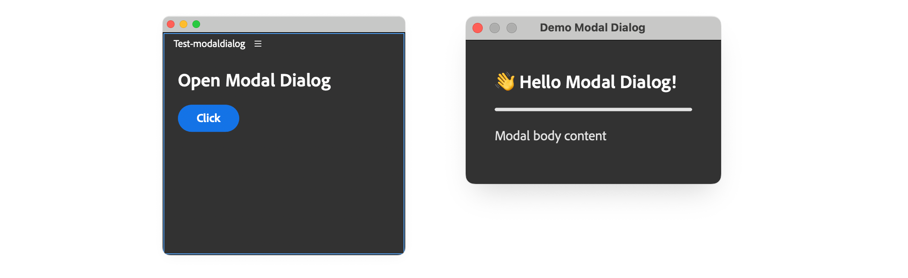
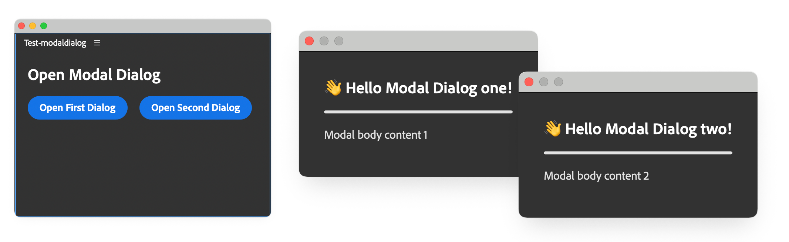
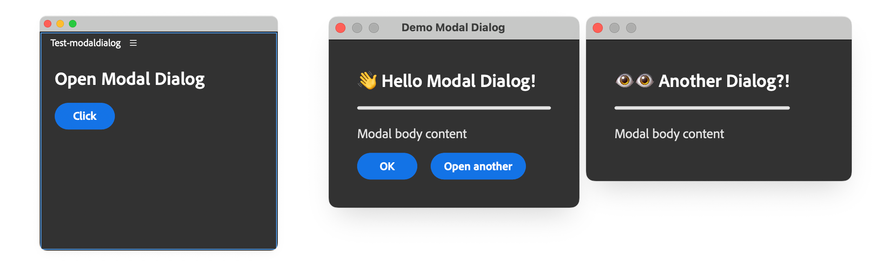
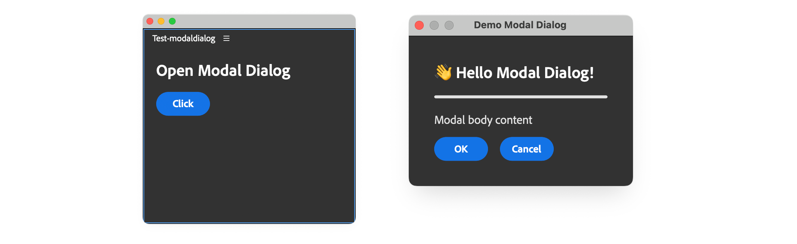
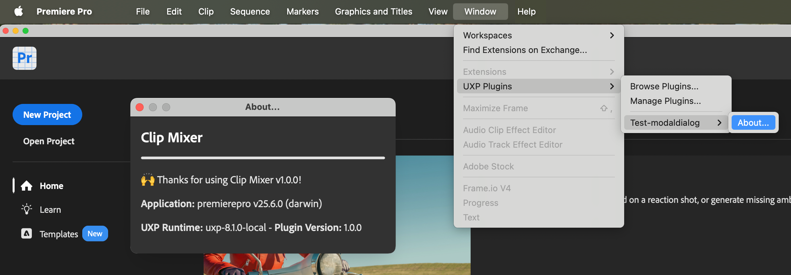
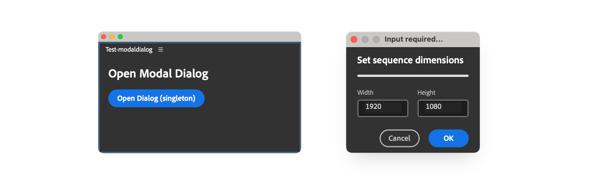

# Add Modal Dialogs

Learn how to create a Modal Dialog as a user interface for Commands or as an additional UI for Panels

## Overview

Modal dialogs are temporary windows that appear on top of the main application interface, demanding user attention before they can continue working. Unlike panels, which can be docked alongside Premiere Pro's workspace, **modal dialogs block interaction with the host application until dismissed**—making them ideal for critical decisions, input forms, or alerts that require immediate user response.

In UXP, modal dialogs serve two primary purposes:

1. **Command UIs**: Provide an interface for command entrypoints that don't need a persistent panel but require user input or display information.
2. **Panel dialogs**: Launch additional interfaces from panels to gather input, show settings, or display detailed information without cluttering the main panel.

You'll learn how to:

- Create modal dialogs triggered by command entrypoints
- Display modal dialogs from panel entrypoints
- Control dialog size and behavior
- Handle user input and dialog results

## Key Concepts

Modal dialogs share the same HTML document as your plugin, similar to [multiple panels](../add-panels/index.md), but they **appear as floating windows** that must be closed before the user can interact with Premiere Pro again. This makes them perfect for workflows that require focused user attention—like configuration wizards, confirmation prompts, or data entry forms.

In their simplest form, modal dialogs are just a `<dialog>` element in the HTML document launched with a `uxpShowModal()` method.



The code below shows a simple modal dialog triggered by a button from the main panel.

<CodeBlock slots="heading, code" repeat="2" languages="HTML, JavaScript" />

#### index.html

```html
<!DOCTYPE html>
<html>
<head>
  <script src="main.js"></script>
  <link rel="stylesheet" href="style.css" />
</head>
<body>
  <!-- Panel content -->
  <sp-heading>Open Modal Dialog</sp-heading>
  <sp-button id="openDialogBtn">Click</sp-button>

  <!-- Modal dialog content (hidden by default) -->
  <dialog>
    <sp-heading>👋 Hello Modal Dialog!</sp-heading>
    <sp-divider size="L"></sp-divider>
    <sp-body>Modal body content</sp-body>
  </dialog>

</body>
</html>
```

#### main.js

```javascript
const openDialogBtn = document.getElementById("openDialogBtn");
openDialogBtn.addEventListener("click", () => {
  const dialog = document.querySelector("dialog");
  dialog.uxpShowModal({                      // 👈
    title: "Demo Modal Dialog",              // 👈
    resize: "none",                          // 👈
    size: { width: 300, height: 300 },       // 👈
  });                                        // 👈
});
```

### Modal Dialog creation properties

The `uxpShowModal()` method is **asynchronous**, it returns a Promise that resolves with the value passed to `dialog.close()`, and accepts an options object with the following properties.

| Property            | Type                                                   | Description                                    |
| :------------------ | :----------------------------------------------------- | :--------------------------------------------- |
| **title**           | string                                                 | The title of the dialog                        |
| **titleVisibility** | `"show"` \| `"none"`                                   | Whether to show the title                      |
| **resize**          | `"none"` \| `"both"` \| `"horizontal"` \| `"vertical"` | Whether to allow the user to resize the dialog |
| **size**            | `{ width: number; height: number; }`                   | The size of the dialog                         |
| **minSize**         | `{ width: number; height: number; }`                   | The minimum size of the dialog                 |
| **maxSize**         | `{ width: number; height: number; }`                   | The maximum size of the dialog                 |

### Multiple Modal Dialogs

Given how modal dialogs are implemented, nothing prevents you from **adding multiple `<dialog>` elements** in your HTML document, each with its own content; you can reference them by `id` and open them independently using the `uxpShowModal()` method.



As they're originated from the same Panel and are modal (blocking) dialogs, only one can be open at a time.

<CodeBlock slots="heading, code" repeat="2" languages="HTML, JavaScript" />

#### index.html

```html
<!DOCTYPE html>
<html>
<head>
  <script src="main.js"></script>
  <link rel="stylesheet" href="style.css" />
</head>
<body>

  <sp-heading>Open Modal Dialog</sp-heading>
  <sp-button-group>
    <sp-button id="openFirstDialogBtn">Open First Dialog</sp-button>
    <sp-button id="openSecondDialogBtn">Open Second Dialog</sp-button>
  </sp-button-group>

  <!-- first modal -->
  <dialog id="modal1">
    <sp-heading>👋 Hello Modal Dialog!</sp-heading>
    <sp-divider size="L"></sp-divider>
    <sp-body>Modal body content 1</sp-body>
  </dialog>

  <!-- second modal -->
  <dialog id="modal2">
    <sp-heading>👋 Hello Another Modal Dialog!</sp-heading>
    <sp-divider size="L"></sp-divider>
    <sp-body>Modal body content 2</sp-body>
  </dialog>

</body>
</html>
```

#### main.js

```javascript
const modal1 = document.getElementById("modal1");
const modal2 = document.getElementById("modal2");

documwent.querySelector("#openFirstDialogBtn")
  .addEventListener("click", () => {
    modal1.uxpShowModal({ /* ... options ... */ });
  });

document.querySelector("#openSecondDialogBtn")
  .addEventListener("click", () => {
  modal2.uxpShowModal({ /* ... options ... */ });
});
```

Additionally, you can **chain modal dialogs** by opening a modal dialog from another modal dialog. Just add the relevant UI elements and event handlers to the modal dialog you want to open from. Being chained, both dialogs are open at the same time, but the first one will be blocked until the second is closed.



## Dialog Lifecycle and Event Handling

Modal dialogs can be programmatically closed by calling the `close()` method on the dialog element itself. This method takes an optional value that is returned to the code that called `uxpShowModal()` when the Promise resolves. You can use this value to pass data back to the caller or to signal how the dialog was dismissed.

### Example: Close a Modal Dialog and return a value

In this example, we'll create a modal dialog with two buttons: **OK** and **Cancel**. When the user clicks either button, the dialog closes and returns the corresponding value—`"ok"` or `"cancel"`.



Please note that, in order to capture the returned value, you need to use the `await` keyword when calling `uxpShowModal()` and the "click" event handler on the buttons must be `async`.

<CodeBlock slots="heading, code" repeat="2" languages="HTML, JavaScript" />

#### index.html

```html
<!DOCTYPE html>
<html>
<head>
  <script src="main.js"></script>
  <link rel="stylesheet" href="style.css" />
</head>

<body>
  <sp-heading>Open Modal Dialog</sp-heading>
  <sp-button id="openDialogBtn">Click</sp-button>

  <dialog>
    <sp-heading>👋 Hello Modal Dialog!</sp-heading>
    <sp-divider size="L"></sp-divider>
    <sp-body>Modal body content</sp-body>
    <sp-button-group>
      <sp-button id="closeDialogBtn">OK</sp-button>
      <sp-button id="cancelDialogBtn">Cancel</sp-button>
    </sp-button-group>
  </dialog>

</body>
</html>
```

#### main.js

```javascript
// Modal Dialog reference
const mDialog = document.querySelector("dialog");

// Modal dialog buttons event handlers -----------------------
mDialog?.querySelector("#closeDialogBtn")
  ?.addEventListener("click", (evt) => {
    mDialog.close("ok");
  });
// Cancel button event handler on the modal dialog
mDialog?.querySelector("#cancelDialogBtn")
  ?.addEventListener("click", (evt) => {
    mDialog.close("cancel");
  });

// Open dialog button event handler -------------------------
document
  .querySelector("#openDialogBtn")
  ?.addEventListener("click", async () => {
    console.log("Opening dialog");
    const res = await mDialog?.uxpShowModal({
      title: "Demo Modal Dialog",
      resize: "none",
      size: { width: 300, height: 300 },
    });
    console.log("Dialog closed with:", res); // 👈 "ok", "cancel", or
                                             // 👈 "reasonCanceled"!
  });
```

<InlineAlert variant="warning" slots="header, text" />

Dialog dismissal

When users close the dialog by clicking the **red dot** (Mac) or **X** button (Windows) in the title bar, or by pressing the **Esc** key, the `close()` method is called with the value **`"reasonCanceled"`**. Make sure to handle this value in your code to provide a consistent user experience.

## Modal Dialogs as Command UIs

Modal dialogs are perfect to show a simple interface for a command, when the built-in [`alert()`](../../../uxp-api/reference-js/Global%20Members/HTML%20DOM/alert.md), [`prompt()`](../../../uxp-api/reference-js/Global%20Members/HTML%20DOM/prompt.md) and [`confirm()`](../../../uxp-api/reference-js/Global%20Members/HTML%20DOM/confirm.md) methods are not enough. The example below shows how to create a dialog for an About command.



These are often very simple UIs, used to show information about the plugin or copyright data.

### Example: About dialog

<CodeBlock slots="heading, code" repeat="2" languages="JavaScript, json" />

#### main.js

```javascript
const { entrypoints, host, versions } = require("uxp");
const manifest = require("./manifest.json");
const os = require("os");

entrypoints.setup({
  commands: {
    "about-command": async () => {
      // Create the dialog dynamically (or load from an HTML file)
      const dialog = document.createElement("dialog");
      dialog.innerHTML = `
        <sp-heading>Clip Mixer</sp-heading>
        <sp-divider size="L"></sp-divider>
        <sp-body>🙌 Thanks for using Clip Mixer v${manifest.version}!</sp-body>
        <sp-body><b>Application:</b> ${host.name} v${
        host.version
      } (${os.platform()})</sp-body>
        <sp-body><b>UXP Runtime:</b> ${versions.uxp} - <b>Plugin Version:</b> ${
        versions.plugin
      }</sp-body>
      `.trim();
      // ☝ trim is a safety measure to avoid whitespace issues

      document.body.appendChild(dialog);

      // Add styles programmatically using element.style
      dialog.style.color = "white";
      dialog.style.padding = "16px";
      dialog.querySelector("sp-divider").style.margin = "0 0 16px 0";
      dialog.querySelector("sp-heading").style.margin = "0 0 16px 0";

      // Show modal
      await dialog.uxpShowModal({
        title: "Command Modal Dialog",
        resize: "none",
        size: { width: 300, height: 200 },
      });
    },
  },
});
```

#### manifest.json

```json
{
  "id": "Test-modaldialog",
  "name": "Test-modaldialog",
  "version": "1.0.0",
  "main": "main.js",
  "host": { "app": "premierepro", "minVersion": "25.6.0" },
  "manifestVersion": 5,
  "entrypoints": [
    {
      "id": "about-command",
      "type": "command",
      "label": "About..."
    }
  ],
  "icons": [ /* ... icons ... */ ],
}
```

In the example above, the `about-command` is defined in the `entrypoints` array of the `manifest.json` file and implemented via `entrypoints.setup()` in the `main.js` file—see [this guide](../../concepts/entrypoints/index.md#commands-and-panels) if you need a refresher on Commands concepts, and [this tutorial](../add-commands/index.md) for implementation examples.

Also note that the entire UI is created with a mix of JavaScript methods (for the parent `<dialog>` element and the styling), and Template Literals for easier readability.

<InlineAlert variant="info" slots="header, text" />

Trim Template Literals

When using Template Literals for the `dialog.innerHTML` property, it's a good practice to use the `trim()` method to remove any whitespace from the beginning and end of the string, which would otherwise create problems.

## Load external HTML files

To keep your code organized, you can load the HTML content from an external file. In UXP, it is extremely easy to do so using the `fetch()` method; just make sure to handle the response as a text string and remember that the methods are asynchronous. Using the same structure from the previous example, we can load the HTML content from an external file and use it to fill the `dialog.innerHTML` property.

<CodeBlock slots="heading, code" repeat="3" languages="JavaScript, html, json" />

#### main.js

```javascript
const { entrypoints, host, versions } = require("uxp");
const manifest = require("./manifest.json");
const os = require("os");

entrypoints.setup({
  commands: {
    "about-command": async () => {
      // Load the HTML content from an external file
      // In this case, the _dialog.html file is located in the
      // same directory as the main.js file
      const dialogHtml = await fetch("./_dialog.html") // 👈
        .then((res) => res.text())    // 👈 handle the response as text
      console.log("About command");
      const dialog = document.createElement("dialog");
      dialog.innerHTML = dialogHtml.trim();
      // ...
      // Replace the placeholders with the actual values. It is the
      // equivalent of using Template Literals in the previous example
      dialog.querySelector("#version").textContent = manifest.version;
      dialog.querySelector("#app-name").textContent = host.name;
      dialog.querySelector("#app-version").textContent = host.version;
      dialog.querySelector("#platform").textContent = os.platform();
      dialog.querySelector("#uxp-version").textContent = versions.uxp;
      dialog.querySelector("#plugin-version").textContent = versions.plugin;
      // ...
      document.body.appendChild(dialog);
      // ...
      const result = await dialog.uxpShowModal({ /* ... */ });
    }
  }
});
```

#### \_dialog.html

```html
<sp-heading>Clip Mixer</sp-heading>
<sp-divider size="L"></sp-divider>
<sp-body>🙌 Thanks for using Clip Mixer v<span id="version"></span>!</sp-body>
<sp-body><b>Application:</b> <span id="app-name"></span> v<span id="app-version"></span> (<span id="platform"></span>)</sp-body>
<sp-body><b>UXP Runtime:</b> <span id="uxp-version"></span> - <b>Plugin Version:</b> <span id="plugin-version"></span></sp-body>
```

#### manifest.json

```json
{
  "id": "Test-modaldialog",
  "name": "Test-modaldialog",
  "version": "1.0.0",
  "main": "main.js",
  "host": { "app": "premierepro", "minVersion": "25.6.0" },
  "manifestVersion": 5,
  "entrypoints": [
    {
      "id": "about-command",
      "type": "command",
      "label": "About..."
    }
  ],
  "icons": [ /* ... icons ... */ ],
}
```

Compared to the [previous example](#example-about-dialog), in this one it is slightly more tedious to fill the dialog with values: with Template Literals you can use the `${}` syntax to insert the values directly into the string, but with external HTML files you need to use the `querySelector()` method to select the `<span>` elements and set the values programmatically.

Please note that the `"main"` property in the `manifest.json` file is still set to `"main.js"`, a JavaScript file—even if we are loading the dialog content from an external `.html` file.

<InlineAlert variant="info" slots="header, text, text2" />

Use `fetch()` and `require()` with external files

In the [original About dialog example](#example-about-dialog), we used `require()` to import the `manifest.json` file and extract the plugin version. This is a handy trick to access the plugin's metadata from the `main.js` file; in general, `require()` works for any `.js` and `.json` files that are local to the plugin.

For all other file formats, you may use the `fetch()` or the `fs` methods illustrated in the [Working with the file system](../../../resources/recipes/filesystem-operations/index.md#the-fs-module) tutorial.

## Singleton pattern for Modal Dialogs

For complex dialogs, we recommend using a Singleton pattern to encapsulate the dialog logic and UI. This approach lets you separate dialog creation, initialization, and running logic in a way that's both maintainable and safe against handler duplication when your script is re-evaluated.

```javascript
class ModalDialog {
  // Singleton support
  static #instance;

  // Private state
  #dialog;
  #params; // (optional) store validated values collected from the UI

  // Enforce the singleton: return the existing instance if present
  constructor() {
    if (ModalDialog.#instance) return ModalDialog.#instance;
    ModalDialog.#instance = this;
  }
  // get (or lazily create) the singleton instance
  static getInstance() {
    if (!ModalDialog.#instance) ModalDialog.#instance = new ModalDialog();
    return ModalDialog.#instance;
  }

  // Build the dialog UI and assign to #dialog
  async createDialog() { /* ... */ }

  // Set defaults and wire listeners
  initDialog() { /* ... */ }

  // Show the dialog and return a Promise with the result
  async runDialog() { /* ... */ }

  // Private: execute Host App DOM logic as needed
  async #runRoutine() { /* ... */ }
}

// Example usage
try {
  const modalDialog = ModalDialog.getInstance();
  await modalDialog.createDialog();
  modalDialog.initDialog();
  const res = await modalDialog.runDialog();
  res;
} catch (error) {
  console.error("Argh!", error);
}
```

A brief explanation of the properties and methods is as follows.

| Property/Method        | Description                                                                                                                                   |
| :--------------------- | :-------------------------------------------------------------------------------------------------------------------------------------------- |
| `static #instance`     | Private static field holding the **singleton instance**. Ensures only one dialog object exists and is reused.                                 |
| `#dialog`              | Private **reference to the** `<dialog>` element; used internally to show/close the modal.                                                     |
| `#params`              | Private **state container for validated values** gathered from the UI (optional but useful for passing data to routines).                     |
| `constructor()`        | **Enforces the singleton** by returning the existing instance when one already exists.                                                        |
| `static getInstance()` | **Convenience accessor** that returns (or lazily creates) the singleton instance. Prefer this over `new` in calling code.                     |
| `async createDialog()` | **Builds the dialog UI** and assigns it to `#dialog`. Designed to be called once and then reused on subsequent opens.                         |
| `initDialog()`         | **Initializes** the dialog with default values and **attaching event listeners** (e.g., button clicks, form changes, focus/blur events, etc.) |
| `async runDialog()`    | **Displays the modal** and resolves when the dialog closes.                                                                                   |
| `async #runRoutine()`  | Private method to **run any Host App DOM code** using the data collected in the dialog.                                                       |

### Example: real-world Dialog

Let's see a practical example of how to use the Singleton pattern to create a modal dialog opened by a Panel. The files are organized as follows:

```text
 📁 .                    Plugin root directory
 ├── 📂 fragments        Dialog-specific files
 │   ├── 📄 dialog.html  Modal dialog UI markup
 │   └── 🎨 styles.css   Dialog-specific styles
 ├── 📄 index.html       Main panel UI
 ├── 🎨 style.css        Main panel styles
 ├── ⚙️ main.js          Main panel and Dialog logic
 └── 📋 manifest.json    Plugin configuration
```

From the files tree alone, you can see that we'll make use of **fragments** to keep the dialog UI and styles separate and avoid using Template Literals or, worse, create all the elements programmatically in the `main.js` file.



The dialog we'll create will be a fictitious "Set sequence dimensions" tool, that allows the user to set the width and height of the sequence. It's stripped from Premiere Pro's API code, but we've kept the logic and the UI as close as possible to the real thing.

<CodeBlock slots="heading, code" repeat="6" languages="HTML, CSS, JavaScript, HTML, CSS, JSON" />

#### index.html

```html
<!DOCTYPE html>
<html>
<head>
  <script src="main.js"></script>
  <link rel="stylesheet" href="style.css" />
</head>

<body>
  <sp-heading>Open Modal Dialog</sp-heading>
  <sp-button id="openDialogBtn">Open Dialog (singleton)</sp-button>
</body>
</html>
```

#### styles.css

```css
body { color: white; padding: 16px; }

sp-divider, sp-heading { margin: 0 0 16px 0; }
```

#### main.js

```javascript
// Global constants for the dialog
const G = {
  version: "1.0.0",
  title: "Input required...",
  dialogSize: { width: 240, height: 150 },
  defaultValues: { width: 1920, height: 1080 },
  valueRange: { min: 320, max: 10240 },
};

class ModalDialog {
  static #instance; // Singleton instance
  #dialog;          // Reference to the dialog element
  // State container for validated values
  #params = { width: 0, height: 0 };

  constructor() {
    // Enforce singleton pattern
    if (ModalDialog.#instance) { return ModalDialog.#instance; }
    ModalDialog.#instance = this;
  }

  // Static getter for singleton instance (optional, cleaner API)
  static getInstance() {
    if (!ModalDialog.#instance) {
      ModalDialog.#instance = new ModalDialog();
    }
    return ModalDialog.#instance;
  }

  // Create and populate a dialog w/ HTML elements
  // Assign to #dialog
  // Uses the same pattern as styles: create once, reuse thereafter
  async createDialog() {
    // Add scoped styles to the head
    // The conditional check ensures the styles are added only once
    // to avoid duplicates when the dialog is opened multiple times
    if (!document.querySelector("#modal-dialog-styles")) {
      const styleEl = document.createElement("style");
      styleEl.id = "modal-dialog-styles";
      styleEl.textContent = (
        await fetch("./fragments/styles.css").then((res) => res.text())
      ).trim();
      document.head.appendChild(styleEl);
    }

    // Same pattern for the dialog: create once, reuse thereafter
    if (!document.querySelector("#modal-dialog")) {
      this.#dialog = document.createElement("dialog");
      this.#dialog.id = "modal-dialog";
      // Add unique class for scoping the CSS
      this.#dialog.classList.add("modal-dialog");
      this.#dialog.innerHTML = (
        await fetch("./fragments/dialog.html").then((res) => res.text())
      ).trim();
      document.body.appendChild(this.#dialog);
    } else {
      // Reuse existing dialog
      this.#dialog = document.querySelector("#modal-dialog");
    }
  }

  // Populate w/ default values
  // Attach event listeners (only once)
  initDialog() {
    const wField = this.#dialog.querySelector("#width");
    const hField = this.#dialog.querySelector("#height");

    // Always reset to default values on each init
    wField.value = G.defaultValues.width.toString();
    hField.value = G.defaultValues.height.toString();

    // Attach event listeners only once; check the dialog element itself
    // since the dialog persists but new instances are created each time
    if (!this.#dialog.dataset.listenersAttached) {
      // Sanitize input for the textfields
      const sanitizeInput = (evt) => {
        /* ... */
      };
      wField.addEventListener("input", sanitizeInput);
      hField.addEventListener("input", sanitizeInput);

      // Validate and return params object if valid, null if invalid
      const validateAndGetParams = () => {
        const w = parseInt(wField.value);
        const h = parseInt(hField.value);
        if (
          isNaN(w) || isNaN(h) ||
          w < G.valueRange.min || w > G.valueRange.max ||
          h < G.valueRange.min || h > G.valueRange.max
        ) {
          return null;
        }
        return { width: w, height: h };
      };

      this.#dialog
        .querySelector("#okDialogBtn")
        .addEventListener("click", () => {
          const params = validateAndGetParams();
          if (params) {
            // Store validated params for use in #runRoutine
            this.#params = params;
            this.#dialog.close("ok");
          } else {
            // alert the user that the parameters are invalid
            alert("Invalid parameters");
          }
        });
      this.#dialog
        .querySelector("#cancelDialogBtn")
        .addEventListener("click", () => {
          this.#dialog.close("cancel");
        });

      this.#dialog.addEventListener("keydown", (evt) => {
        if (evt.key === "Enter") {
          const params = validateAndGetParams();
          if (params) {
            this.#params = params;
            this.#dialog.close("ok");
          }
        }
      });

      // Mark the dialog element itself as having listeners attached
      this.#dialog.dataset.listenersAttached = "true";
    }
  }

  async runDialog() {
    const rv = await this.#dialog.uxpShowModal({
      title: G.title,
      resize: "none",
      size: G.dialogSize,
    });

    if (rv === "ok") {
      console.log("Dialog closed with OK");
      const res = await this.#runRoutine();
      if (res === true) return true;
      throw res; // bubble any routine error
    }

    if (rv === "cancel" || rv === "reasonCanceled") {
      throw "cancel";
    }

    throw "Dialog closed unexpectedly";
  }

  // Run whatever Host App DOM code is needed
  // Has access to validated params via this.#params
  async #runRoutine() {
    console.log("Running PPro routine with params:", this.#params);
    //... perform the (fictitious) routine using
    // this.#params.width and this.#params.height
    return true;
  }

  // Getter to access validated params (if needed by external code)
  getParams() {
    // Return a copy to prevent external mutation
    return { ...this.#params };
  }
}

const btn = document.querySelector("#openDialogBtn");
if (btn && !btn.dataset.listenerAttached) {
  btn.addEventListener("click", async () => {
    try {
      // const modalDialog = new ModalDialog() // 👈 same 👇
      const modalDialog = ModalDialog.getInstance();
      await modalDialog.createDialog();
      modalDialog.initDialog();
      const res = await modalDialog.runDialog();
      res;
    } catch (error) {
      console.error("Arrgh!", error);
    }
  });
  // ✅ ensure we only wire the listener once
  btn.dataset.listenerAttached = "true";
}
```

#### fragments/dialog.html

```html
<div class="wrapper">
  <sp-heading size="S">Set sequence dimensions</sp-heading>
  <sp-divider size="L"></sp-divider>
  <div class="row spaced">
    <sp-textfield id="width" type="number">
      <sp-label slot="label">Width</sp-label>
    </sp-textfield>
    <sp-textfield id="height" type="number">
      <sp-label slot="label">Height</sp-label>
    </sp-textfield>
  </div>
  <sp-button-group>
    <sp-button variant="secondary" id="cancelDialogBtn">
      Cancel
    </sp-button>
    <sp-button variant="cta" id="okDialogBtn">
      OK
    </sp-button>
  </sp-button-group>
</div>
```

#### fragments/styles.css

```css
/* Everything is scoped for the modal dialog only */
dialog.modal-dialog { padding: 0; }

dialog.modal-dialog .wrapper {
  min-height: 100vh; overflow: hidden;
  padding: 10px 20px; display: flex; flex-direction: column;
}

dialog.modal-dialog .row {
  display: flex; flex-direction: row; justify-content: space-between;
}

dialog.modal-dialog .spaced { margin-bottom: 16px; }

dialog.modal-dialog sp-textfield {
  display: flex; width: 92px; margin-bottom: 6px;
}

dialog.modal-dialog sp-button-group {
  display: flex; flex-direction: row; justify-content: flex-end;
}
```

#### manifest.json

```json
{
  "id": "Test-modaldialog",
  "name": "Test-modaldialog",
  "shortname": "3pstarterplugin",
  "version": "1.0.0",
  "main": "index.html",
  "host": { "app": "premierepro", "minVersion": "25.6.0" },
  "manifestVersion": 5,
  "requiredPermissions": { "localFileSystem": "request" },
  "featureFlags": { "enableAlerts": true },
  "entrypoints": [
    {
      "id": "starterpanel",
      "type": "panel",
      "minimumSize": { "width": 430, "height": 500 },
      "maximumSize": { "width": 2000, "height": 2000 },
      "preferredDockedSize": { "width": 230, "height": 300 },
      "preferredFloatingSize": { "width": 400, "height": 300 },
      "label": { "default": "PremierePro Modal Dialog" },
      "icons": [
        {
          "width": 23, "height": 23, "path": "icons/dark.png",
          "scale": [ 1, 2 ], "theme": [ "darkest", "dark", "medium" ]
        },
        {
          "width": 23, "height": 23, "path": "icons/light.png",
          "scale": [ 1, 2 ], "theme": [ "lightest", "light" ]
        },
      ]
    }
  ],
  "icons": [
    {
      "width": 48, "height": 48, "path": "icons/plugin-icon.png",
      "theme": [
        "darkest", "dark", "medium", "lightest", "light", "all"
      ],
      "species": [ "pluginList" ], "scale": [ 1, 2 ]
    }
  ]
}
```

### Implementation Details

This example demonstrates a production-ready approach to modal dialogs, combining several best practices into a cohesive pattern. Let's examine each file and understand why the code is structured this way.

#### 1. The Panel UI: `index.html` and `style.css`

The main panel is intentionally minimal, just a heading and a button. Nothing different from what we've seen so far.

#### 2. The Manifest: `manifest.json`

The manifest is standard for a panel entrypoint, with the notable inclusion of the `enableAlerts` feature flag, **required to use the `alert()` method** we call in `initDialog()` when validation fails.

#### 3. The Dialog UI: `fragments/dialog.html` and `fragments/styles.css`

The dialog markup lives in a separate `fragments/` directory—a pattern borrowed from web development that keeps the dialog UI portable and maintainable. Please note that the whole `dialog.html` content is wrapped with a `<div>` element, as the `<dialog>` element itself will be created dynamically in the `main.js` file.

The styles use a **scoping technique** to prevent conflicts with the panel styles; in fact, the `<dialog>` element will added a `modal-dialog` class, so the styles will be scoped to the elements it contains and won't leak out. Without it, generic class names like `.wrapper` or `.row` would clash between your dialog and panel styles.

#### 4. The Core Logic: `main.js`

This is where the real work happens. Let's break down the implementation piece by piece.

##### Global Configuration Object

The `G` object centralizes all configuration in one place, and contains title, size, default values, and validation ranges.

##### Singleton Pattern

The Singleton pattern ensures **only one instance of the dialog class exists throughout the plugin's lifetime**. Without the singleton, you'd create duplicate dialog elements and duplicate event listeners every time the script runs—leading to memory leaks and unpredictable behavior.

The `static #instance` field is **private to the class** (note the `#` prefix). When you call `new ModalDialog()`, the constructor checks if an instance already exists, and returns that instance instead of creating a new one. The `getInstance()` static method provides a cleaner API—it's the **preferred way to get the singleton** and makes the intent explicit.

The `#dialog` field stores a reference to the actual `<dialog>` DOM element, while `#params` holds the validated user input (width and height values in our case) once the user clicks OK. Both are private fields that don't need to be accessed externally.

##### `createDialog()`

This method does the heavy lifting of constructing the dialog UI; it's `async` because it uses `fetch()` to load external files. Notice that before creating anything it checks if the element already exists in the DOM using `document.querySelector()`. This is critical for performance and correctness—**you don't want multiple copies of the same dialog** cluttering the DOM.

The method injects the CSS into a `<style>` element in the `<head>`. It assigns an `id` to the style element (`#modal-dialog-styles`) so subsequent calls can detect it and skip re-injection. The dialog element itself gets both an `id` (`modal-dialog`) and a `class` (`modal-dialog`). The ID is for **unique identification and DOM queries**, while the class is for **CSS scoping**—remember those `dialog.modal-dialog` selectors in `styles.css`.

The `else` branch handles the case where the dialog already exists (because the singleton was reused). It simply **grabs the existing reference** instead of creating a new one.

##### `initDialog()`

Once the dialog exists in the DOM, `initDialog()` **sets default values and wires up event listeners**. This method splits into two logical sections:

1. **State reset**.
2. **Event listener attachment**.

The first part **always runs** when you call `initDialog()`—it resets the input fields to their default values. This ensures a clean slate every time the dialog opens. The second part—the event listener setup—is **guarded by a conditional check**. It leverages HTML5 `data-*` attributes to track whether listeners have been attached. If they haven't, the method attaches them and sets the flag to `"true"`. This **prevents listener duplication** when the dialog is opened multiple times—a common source of bugs.

Several helper functions and event handlers are defined:

- **`sanitizeInput()`**: This placeholder function would normally filter out invalid characters or format the input as the user types.
- **`validateAndGetParams()`**: This function **validates the user's input** and returns either an object with validated values or `null` if validation fails. It converts the string values to integers, checks for `NaN` (which happens if the user enters non-numeric text).
- **OK button handler**: When clicked, it calls `validateAndGetParams()`. If validation succeeds, it **stores the validated parameters** in `this.#params` (so they're available to other methods) and closes the dialog with the value `"ok"`. If validation fails, it shows an alert to inform the user. **Never silently fail validation**, as it creates confusion.
- **Cancel button handler**: Simply closes the dialog with the value `"cancel"`.
- **Enter key handler**: Provides **keyboard accessibility** by allowing users to press Enter to submit the dialog instead of clicking OK.

Note that the Enter key handler **doesn't close the dialog on invalid input**. This is intentional: pressing Enter shouldn't do anything if the input is invalid, forcing the user to either correct the input or explicitly cancel. This prevents accidental submissions.

##### `runDialog()`

This method **displays the modal and handles its result**. It awaits `uxpShowModal()`, which **blocks execution until the dialog is dismissed**. The return value (`rv`) is whatever was passed to `dialog.close()` in the event handlers—either `"ok"`, `"cancel"`, or `"reasonCanceled"` (when the user closes the dialog via the title bar or Esc key).

The method uses **exceptions for control flow**: if the user cancels, it throws `"cancel"` rather than returning a value. This forces the calling code to handle cancellation explicitly in a `catch` block, which is a common pattern for operations that can be aborted. If the dialog closes with OK, it calls the private `#runRoutine()` method to perform the actual work (Premiere Pro API calls, in our case).

##### `#runRoutine()`

This private method is where you'd perform **any Host Application DOM operations** using the collected parameters. The `#runRoutine()` call is also error-aware: if it returns `true`, everything succeeded. If it returns anything else (presumably an error message or error object), `runDialog()` **re-throws that error** to bubble it up to the caller. This layered error handling ensures that failures at any level—validation, user cancellation, or routine execution—are properly communicated.

##### `getParams()`

The final method provides **controlled access to the dialog's internal state**. Because `#params` is a private field, external code can't access it directly. This method provides a **read-only view** by returning a shallow copy of the parameters object (using the spread operator `...`). This prevents external code from accidentally (or maliciously) **mutating the internal state** of the dialog.

## Summary

Modal dialogs are temporary, blocking windows that demand user attention before they can continue working with Premiere Pro—ideal for critical decisions, input forms, or alerts.

**Key Concepts:**

1. **Basic structure**: Modal dialogs use a `<dialog>` HTML element launched with the `uxpShowModal()` method, which returns a Promise that resolves when the dialog is closed.
2. **Two primary use cases**:
   - **Command UIs**: Provide interfaces for command entrypoints without needing persistent panels.
   - **Panel dialogs**: Launch additional interfaces from panels to gather input or display information.
3. **Multiple and chained dialogs**: One panel can launch multiple independent modal dialogs (only one open at a time), and dialogs can be chained by opening one from another.
4. **Dialog lifecycle**: Use `dialog.close(value)` to dismiss dialogs and return values to the calling code. Handle the `"reasonCanceled"` return value when users close via the title bar or Esc key.
5. **Best practices**: For complex dialogs, use the Singleton pattern to prevent duplicate DOM elements and event listeners. Load external HTML files with `fetch()` and scope CSS to prevent style conflicts.
