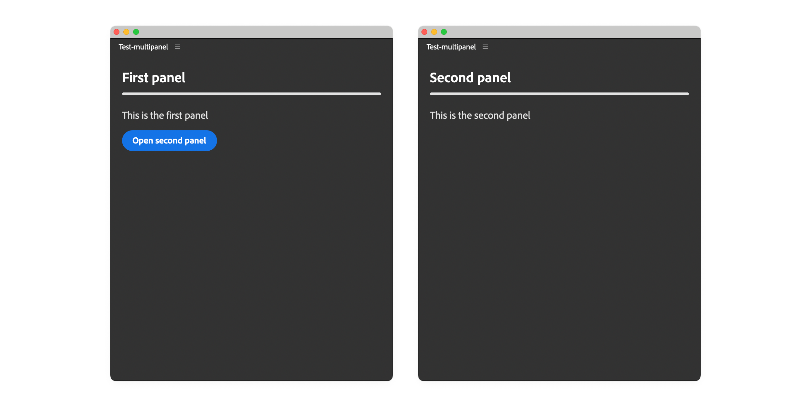

# Add Multiple Panels

Learn how to create a plugin with multiple panel entrypoints and control their display programmatically.

## Overview

While many plugins only need a single panel, UXP allows you to create **multiple panels within the same plugin**. This is useful when you want to organize different features into separate, focused interfaces—for example, a main control panel and a separate settings or preview panel. You'll learn how to:

- Declare multiple panel entrypoints in your manifest
- Structure your HTML to support multiple panels
- Use lifecycle hooks to control panel visibility
- Open panels programmatically from other panels

This tutorial builds on concepts from the [Entrypoints](../../concepts/entrypoints/index.md) and [Lifecycle Hooks](../add-lifecycle-hooks/index.md) guides. If you're new to these topics, we recommend reviewing those first. To programmatically open a panel from another panel, you'll need to use the [Inter-Plugin Communication](../inter-plugin-comm/index.md) tutorial, but it's not strictly necessary to understand how to create multi-panel plugins.

## Key Concepts

A single plugin can expose multiple panels, each appearing as a separate menu item under **Window** > **UXP Plugins** > **ThePluginName**. Each panel:

- Has its own entrypoint definition in the manifest
- Can have its own size constraints and configuration
- Shares the same HTML document and JavaScript context
- Can communicate with other panels in the same plugin

<InlineAlert variant="info" slots="header, text"/>

IPC Permission

To enable inter-panel communication and programmatic panel control, you need to enable the `ipc` (Inter-Process Communication) permission in your manifest.

```json
{
  // ...
  "requiredPermissions": {
    "ipc": { "enablePluginCommunication": true }
  }
  // ...
}
```

When working with multiple panels, you'll use the `show()` [lifecycle hook](../../concepts/entrypoints/index.md#panel-lifecycle-hooks) to append the appropriate content to the panel when it's displayed. This approach keeps your panel content organized and ensures each panel only displays its relevant UI.

<InlineAlert variant="warning" slots="header, text"/>

Known Limitation

The `hide()` lifecycle hook is **not currently working as expected** in Premiere Pro. This means that when a panel is hidden, the `hide()` callback won't be reliably triggered. For now, focus on using the `show()` hook to append content, and be aware that DOM cleanup in `hide()` may not execute. This will be fixed in a future update.

## Implementation

Let's build a plugin with two panels: a main panel and a secondary panel that can be opened from the first.



### 1. Declare Multiple Entrypoints

First, update your `manifest.json` to declare two panel entrypoints. Notice that we also enable the `ipc` permission:

```json
{
  "id": "multi-panel-demo",
  "name": "Multi Panel Demo",
  "version": "1.0.0",
  "main": "index.html",
  "host": { "app": "premierepro", "minVersion": "25.6.0" },
  "manifestVersion": 5,
  "requiredPermissions": {
    // 👇 Required for inter-panel control
    "ipc": { "enablePluginCommunication": true }
  },
  "entrypoints": [
    {
      "id": "uxp-first-panel",
      "type": "panel",
      "label": { "default": "First Panel" },
      "minimumSize": { "width": 430, "height": 500 },
      "preferredDockedSize": { "width": 230, "height": 300 }
      // ...
    },
    {
      "id": "uxp-second-panel",
      "type": "panel",
      "label": { "default": "Second Panel" },
      "minimumSize": { "width": 430, "height": 500 },
      "preferredDockedSize": { "width": 230, "height": 300 }
      // ...
    }
  ]
  // ...
}
```

Both panels will now appear in the **Window** > **UXP Plugins** > **Multi Panel Demo** menu.

### 2. Structure Your HTML

In your `index.html`, create separate wrapper containers for each panel. The second panel needs an `id` attribute so we can reference it in JavaScript later.

```html
<!DOCTYPE html>
<html>
<head>
  <script src="main.js"></script>
  <link rel="stylesheet" href="style.css" />
</head>
<body>
  <!-- First panel content -->
  <div class="wrapper">
    <sp-heading>First Panel</sp-heading>
    <sp-divider size="L"></sp-divider>
    <sp-body>
      This is the first panel.
    </sp-body>
    <sp-button id="open-second-panel">Open Second Panel</sp-button>
  </div>

  <!-- Second panel content -->
  <div class="wrapper" id="second-panel">
    <sp-heading>Second Panel</sp-heading>
    <sp-divider size="L"></sp-divider>
    <sp-body>
      This is the second panel.
    </sp-body>
  </div>
</body>
</html>
```

**Important notes:**

- Both panels share the same HTML document.
- Only the second `<div>` wrapper needs an `id` because we'll append it to the second panel's body and we need a means to reference it.
- The first panel's content is already in the DOM and doesn't need special handling.

<InlineAlert variant="info" slots="text"/>

The `<div>` wrapper `id` (holding the second panel's content) can be different from the second panel's `id` in the manifest.json.

### 3. Implement Lifecycle Hooks

Now, let's use lifecycle hooks to programmatically append the second panel's content to the DOM when the second panel is shown. In your `main.js`:

```javascript
const { entrypoints, pluginManager } = require("uxp");

// Get reference to the second panel container
const secondPanel = document.querySelector("#second-panel");
let PLUGIN_ID;

entrypoints.setup({
  plugin: {
    create() {
      // Store the plugin ID for later use
      // (IPC -> opening the second panel programmatically)
      PLUGIN_ID = this.id;
      console.log("Plugin created:", PLUGIN_ID);
    },
  },
  panels: {
    "uxp-first-panel": {
      create() { console.log("First panel created") },
      show() {
        console.log("First panel shown");
        // The first panel content is already in the DOM
        // no other action is needed.
      },
    },
    "uxp-second-panel": {
      create() { console.log("Second panel created") },
      show(body) {
        // Append the second panel content when this panel is shown
        body.appendChild(secondPanel); // 👈 Key: append on show
        console.log("Second panel shown");
      },
      hide(body) {
        // ⚠️ Note: This hook currently doesn't work reliably
        body.removeChild(secondPanel);
        console.log("Second panel hidden");
      },
    },
  },
});

// Add button handler to open the second panel via IPC
document.querySelector("#open-second-panel")
  .addEventListener("click", () => {
    // Find this plugin in the list of all plugins
    const me = [...pluginManager.plugins].find(
      (plugin) => plugin.id === PLUGIN_ID
    );
    // Open the second panel programmatically
    me?.showPanel("uxp-second-panel"); // 👈 Opens the second panel
});
```

## How It Works

Let's break down the key mechanisms:

### 1. Shared HTML Context

Both panels share the same `index.html` document. When you open either panel from the **Window** menu, Premiere Pro displays the same HTML document—but which content is visible depends on the panel's lifecycle hooks.

### 2. Dynamic Content Appending

The **`show()` lifecycle hook** receives the panel's `body` (root node) as a parameter. When the second panel is shown, we use `body.appendChild(secondPanel)` to inject its content into the DOM. This keeps the second panel's content hidden until explicitly displayed.

### 3. Programmatic Panel Control

The `pluginManager` object provides access to all loaded plugins—see a dedicated tutorial [here](../inter-plugin-comm/index.md). By finding our own plugin in the list (using the stored `PLUGIN_ID`), we can call `showPanel()` to open the second panel programmatically:

```javascript
const me = [...pluginManager.plugins].find(
  (plugin) => plugin.id === PLUGIN_ID
);
me?.showPanel("uxp-second-panel"); // Opens the panel by entrypoint ID
```

<InlineAlert variant="info" slots="text"/>
You can **open panels programmatically, but you cannot close them** via the API. Users must close panels manually through the Premiere Pro interface.

### 4. Inter-Panel Communication

Since both panels share the same JavaScript context, they can easily communicate by sharing variables, calling functions, and using events.

## Use multiple HTML files

You can also use **multiple HTML files, one for each panel**. This is useful when you want to keep the code for each panel separate and avoid clutter in the main `index.html` file. The key is to `fetch()` the second panel's HTML file and inject the content into the DOM, as the following example shows.


<CodeBlock slots="heading, code" repeat="4" languages="HTML, HTML, JavaScript, JSON" />

#### index.html

```html
<!DOCTYPE html>
<html>
<head>
  <script src="main.js"></script>
  <link rel="stylesheet" href="style.css" />
</head>
<body>
  <!-- First panel content -->
  <div class="wrapper">
    <sp-heading>First Panel</sp-heading>
    <sp-divider size="L"></sp-divider>
    <sp-body>
      This is the first panel.
    </sp-body>
    <sp-button id="open-second-panel">Open Second Panel</sp-button>
  </div>

  <!-- Second panel wrapper -->
  <div class="wrapper" id="second-panel">
    <!-- 👁️ 👁️ nothing here yet 👁️ 👁️ -->
  </div>
</body>
</html>

```

#### second-panel.html

```html
<!-- This is what used to be inside the second panel's <div> wrapper -->
<sp-heading>Second Panel</sp-heading>
<sp-divider size="L"></sp-divider>
<sp-body>
  This is the second panel.
</sp-body>
```

#### main.js

```javascript
const { entrypoints, pluginManager } = require("uxp");

// Get reference to the second panel container
const secondPanel = document.querySelector("#second-panel");

// Fetch the second panel's HTML file and inject the content into the DOM
fetch("./second-panel.html")                              // 👈
  // Convert the response to text                         // 👈
  .then(response => response.text())                      // 👈
  // Set the content of the second panel container        // 👈
  .then(html => {                                         // 👈
    secondPanel.innerHTML = html;                         // 👈
    // Add event listeners for the second panel here      // 👈
    // or any other JavaScript code you need              // 👈
    // ...                                                // 👈
  });                                                     // 👈

let PLUGIN_ID;
entrypoints.setup({ /* ... */ });

// Everything else is the same as in the previous example...
```

#### manifest.json

```json
{
  "id": "multi-panel-demo",
  "name": "Multi Panel Demo",
  "version": "1.0.0",
  "main": "index.html",
  "host": { "app": "premierepro", "minVersion": "25.6.0" },
  "manifestVersion": 5,
  "requiredPermissions": {
    // 👇 Required for inter-panel control
    "ipc": { "enablePluginCommunication": true }
  },
  "entrypoints": [
    {
      "id": "uxp-first-panel",
      "type": "panel",
      "label": { "default": "First Panel" },
      "minimumSize": { "width": 430, "height": 500 },
      "preferredDockedSize": { "width": 230, "height": 300 }
      // ...
    },
    {
      "id": "uxp-second-panel",
      "type": "panel",
      "label": { "default": "Second Panel" },
      "minimumSize": { "width": 430, "height": 500 },
      "preferredDockedSize": { "width": 230, "height": 300 }
      // ...
    }
  ]
  // ...
}
```

The example above is rather simple, but it is a technique that comes in handy when the complexity of the panel grows.

## Summary

Multiple panels enable you to organize complex plugins into focused, manageable interfaces that users can access independently.

**Key Takeaways:**

1. **Declare multiple entrypoints** in `manifest.json` with `type: "panel"` for each panel.
2. **Structure the HTML with wrappers**: Use `id` attributes for panels that need dynamic control.
3. **Use the `show()` hook** to append panel content to the DOM when the panel is displayed. Ideally, use `hide()` to remove the content when the panel is hidden.
4. **Use `pluginManager.showPanel()`** to open one panel from another programmatically (remember to enable IPC permissions). Panels cannot be closed programmatically, only opened.
