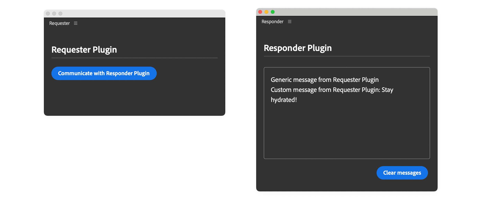

# Inter Plugin Communication

UXP allows communication between plugins installed within the same application

This feature is handy when you know another plugin already automates a specific task; in such cases, you can invoke it instead of duplicating the effort. To provide the best user experience, ensure your plugin clearly communicates such dependencies.

## Overview

The **Plugin Manager** module provides the necessary APIs to establish the connection. Before diving into an example, make sure you're familiar with the following topics:

- [Plugin Entrypoints](../../concepts/entrypoints/index.md)
- [Manifest Permissions](../../concepts/manifest/index.md#permissionsdefinition)

Additionally, you will need to have a basic understanding of the plugin you are going to communicate with, which includes:

- The plugin's `id` and `entrypoints`
- The structure of arguments to be passed, if applicable.

## Implementation

We’ll refer to the two plugins as **Requester** and **Responder**.

### Requester

This is the plugin that will initiate the communication with the Responder. It **must have** the [`enablePluginCommunication`](../../concepts/manifest/index.md#ipcpermission) permission set to `true` in the `manifest.json` file.

```json
{
  // ...
  "requiredPermissions": {
    "ipc": { "enablePluginCommunication": true }
  }
  // ...
}
```

Through the `pluginManager` module, the Requester plugin can get a list of all installed plugins in Premiere Pro and find the Responder plugin by its `id` (which must be known in advance).

```javascript
const { pluginManager } = require("uxp");

const allPlugins = pluginManager.plugins;
const responderPlugin = Array.from(allPlugins)
  .find(plugin => plugin.id === "Test-responder"); // 👈 Responder id
```

When you've stored a reference to the Responder plugin, you can invoke its `command` entrypoints using the `invokeCommand()`, or request to show its panel using the `showPanel()` methods. Pass the `id` of the entrypoint you want to invoke or show.

```javascript
responderPlugin.invokeCommand("simpleCommand");
responderPlugin.showPanel("simplePanel");
```

<InlineAlert variant="info" slots="header, text, text2" />

Payloads

It is possible to pass data using the `invokeCommand()` method:

```javascript
const payload = { message: "From Requester" };
responderPlugin.invokeCommand("simpleCommand", payload);
```

### Responder

This is the plugin that will receive the communication from the Requester plugin. It does not need additional manifest permissions, but the `command` entrypoints the Requester will invoke must be exposed in the `manifest.json` file.

```json
{
  // ...
  "entrypoints": [
    {
      "id": "simplePanel",
      "type": "panel",
      "label": { "default": "Main Panel" },
      // ...
    },
    {
      "id": "simpleCommand",
      "type": "command",
      "label": { "default": "Simple Command" }
    },
    {
      "id": "commandWithInput",
      "type": "command",
      "label": { "default": "Command With Input" }
    }
  ],
  // ...
}
```

The commands should also be implemented in the `index.js` file. For more information, please refer to the [Add Commands](../add-commands/index.md) tutorial.

## Example

In this example, the Requester plugin implements a button that will initiate three requests to the Responder plugin:

- show the Responder's panel
- invoke the Responder's `simpleCommand` entrypoint
- invoke the Responder's `commandWithInput` entrypoint, with an input payload

The Responder plugin will log the requests in the panel's body.



### Requester code

<CodeBlock slots="heading, code" repeat="4" languages="HTML, CSS, JavaScript, JSON" />

#### index.html

```html
<!DOCTYPE html>
<html>
<head>
  <script src="main.js"></script>
  <link rel="stylesheet" href="style.css" />
</head>
<body>
  <sp-heading>Requester Plugin</sp-heading>
  <sp-divider></sp-divider>
  <div class="main-div">
    <sp-body id="plugin-body">
      <sp-button id="btnCommunicate">
        Communicate with Responder Plugin
      </sp-button>
    </sp-body>
  </div>
</body>
</html>
```

#### style.css

```css
body { padding: 16px; color: white; }

sp-divider { margin-bottom: 20px; }

sp-heading { color: var(--uxp-host-text-color-secondary, white); }

```

#### index.js

```js
//global objects.
const { pluginManager } = require("uxp");

document
  .querySelector("#btnCommunicate")
  .addEventListener("click", communicateWithAnotherPlugin);

function communicateWithAnotherPlugin() {
  try {
    const allPlugins = pluginManager.plugins;
    const plugin = Array.from(allPlugins).find(
      (plugin) => plugin.id === "Test-responder"
    );
    if (plugin && plugin.enabled) {
      console.log("All commands:", plugin.manifest.commands);
      console.log("All panels:", plugin.manifest.panels);

      // Show the plugin panel
      // Note that panels can only be made visible
      // You can't ask to hide a panel
      plugin.showPanel("simplePanel");

      // Invoke the command
      plugin.invokeCommand("simpleCommand");

      // Send an payload to the command
      const payload = { message: "Stay hydrated!" };
      // Invoke the command with the payload
      plugin.invokeCommand("commandWithInput", payload.message);
    } else {
      // Prompt the user to install/enable the plugin before trying again
    }
  } catch (e) {
    console.error(e);
  }
}

```

#### manifest.json

```json
{
  "id": "Test-requester",
  "name": "Requester",
  "shortname": "3pstarterplugin",
  "version": "1.0.0",
  "main": "index.html",
  "host": { "app": "premierepro", "minVersion": "25.6.0" },
  "manifestVersion": 5,
  "requiredPermissions": {
    "localFileSystem": "request",
    "clipboard": "readAndWrite",
    "ipc": { "enablePluginCommunication": true }
  },
  "entrypoints": [
    {
      "id": "starterpanel",
      "type": "panel",
      "minimumSize": { "width": 430, "height": 500 },
      "maximumSize": { "width": 2000, "height": 2000 },
      "preferredDockedSize": { "width": 230, "height": 300 },
      "preferredFloatingSize": { "width": 400, "height": 300 },
      "label": { "default": "PremierePro IPC Panel" },
      "icons": [
        {
          "width": 23, "height": 23,
          "path": "icons/dark.png", "scale": [1,2],
          "theme": [ "darkest", "dark", "medium" ]
        },
        {
          "width": 23, "height": 23,
          "path": "icons/light.png", "scale": [1,2],
          "theme": [ "lightest", "light" ]
        }
      ]
    }
  ],
  "icons": [
    {
      "width": 48, "height": 48, "path": "icons/plugin-icon.png",
      "scale": [1,2],
      "theme": [ "darkest", "dark", "medium", "lightest", "light", "all" ],
      "species": [ "pluginList" ]
    }
  ]
}
```

### Responder code

<CodeBlock slots="heading, code" repeat="4" languages="HTML, CSS, JavaScript, JSON" />

#### index.html

```html
<!DOCTYPE html>
<html>
<head>
  <script src="main.js"></script>
  <link rel="stylesheet" href="style.css" />
</head>
<body>
  <sp-heading>Responder Plugin</sp-heading>
  <sp-divider></sp-divider>
  <div class="main-div">
    <sp-body id="plugin-body"> </sp-body>
  </div>
  <footer>
    <sp-button id="clear-btn">Clear messages</sp-button>
  </footer>
</body>
</html>
```

#### style.css

```css
body { color: white; padding: 16px; }

sp-divider { margin-bottom: 20px; }

li:before { content: "• "; width: 3em; }

#plugin-body {
  color: var(--uxp-host-text-color-secondary, white);
  height: 220px; margin-top: 5px; border: 1px solid #808080;
  border-radius: 4px; padding: 16px; overflow: scroll;
}

sp-heading { color: var(--uxp-host-text-color-secondary, white); }

footer {
  display: flex; flex-wrap: wrap; justify-content: flex-end; }

footer > * { margin: 5px; }

footer div { margin-bottom: 1em; width: 100%; }

.main-div { position: relative; }

.clear-btn {
  display: none; position: absolute; top: 10px; right: 6px; cursor: pointer;
}

.main-div:hover .clear-btn { display: inline; }
```

#### index.js

```js
//global objects.
const { entrypoints } = require("uxp");

entrypoints.setup({
  commands: {
    simpleCommand: () => doThing(),
    commandWithInput: (args) => doThing(args),
  },
  panels: { simplePanel: { show(rootNode) {} },
  },
});

// Log messages to the panel's body
function logToPanel(msg) {
  const bodyElement = document.getElementById("plugin-body");
  const message =
    msg === undefined
      ? `Generic message from Requester Plugin <br />`
      : `<span>Custom message from Requester Plugin: ${msg}</span><br />`;
  bodyElement.innerHTML += message;
}

// Commands handler
function doThing(args) {
  console.log("payload", args);
  // Pass a payload (if any) to the panel
  logToPanel(args && args.data[0]);
}

// Clear the panel's body
document.getElementById("clear-btn").addEventListener("click", () => {
  const bodyElement = document.getElementById("plugin-body");
  if (bodyElement) {
    bodyElement.innerHTML = "";
  }
});

```

#### manifest.json

```json
{
  "id": "Test-responder",
  "name": "Responder",
  "shortname": "3pstarterplugin",
  "version": "1.0.0",
  "main": "index.html",
  "host": { "app": "premierepro", "minVersion": "25.6.0" },
  "manifestVersion": 5,
  "entrypoints": [
    {
      "id": "simplePanel",
      "type": "panel",
      "minimumSize": { "width": 430, "height": 500 },
      "maximumSize": { "width": 2000, "height": 2000 },
      "preferredDockedSize": { "width": 230, "height": 300 },
      "preferredFloatingSize": { "width": 400, "height": 300 },
      "label": { "default": "Main Panel" },
      "icons": [
        {
          "width": 23, "height": 23,
          "path": "icons/dark.png", "scale": [1,2],
          "theme": [ "darkest", "dark", "medium" ]
        },
        {
          "width": 23, "height": 23,
          "path": "icons/light.png", "scale": [1,2],
          "theme": [ "lightest", "light" ]
        }
      ]
    },
    {
      "id": "simpleCommand",
      "type": "command",
      "label": {
        "default": "Simple Command"
      }
    },
    {
      "id": "commandWithInput",
      "type": "command",
      "label": {
        "default": "Command With Input"
      }
    }
  ],
  "icons": [
    {
      "width": 48, "height": 48, "path": "icons/plugin-icon.png",
      "scale": [1,2],
      "theme": [ "darkest", "dark", "medium", "lightest", "light", "all" ],
      "species": [ "pluginList" ]
    }
  ]
}
```

## Additional notes

- You **may not see any error if the entrypoint is not found**. We recommend using `plugin.manifest.commands` and `plugin.manifest.panels` to select from the actual list of entrypoints.
  Users may have turned off a particular plugin via the Adobe Creative Cloud Desktop App. Before invoking it, check the plugin's availability by using `plugin.enabled`.
- You cannot pass methods in the payload object.
- Cross-application communication is not supported (e.g., Premiere Pro to Photoshop).

## Summary

Inter-plugin communication enables UXP plugins to invoke commands and show panels from other installed plugins within Adobe Premiere Pro.

**Key Concepts:**

1. **Requester plugin**: This plugin initiates communication and requires the `enablePluginCommunication: true` permission in `manifest.json`.
   - **Plugin Manager**: Use `pluginManager.plugins` to discover and reference other installed plugins by their `id`.
   - **Communication methods**: `invokeCommand()` to execute commands and `showPanel()` to display panels from the target plugin.
2. **Responder plugin**: This plugin receives communication requests, exposes entrypoints in its manifest (no special permissions are needed), and implements the entrypoints in its code.
