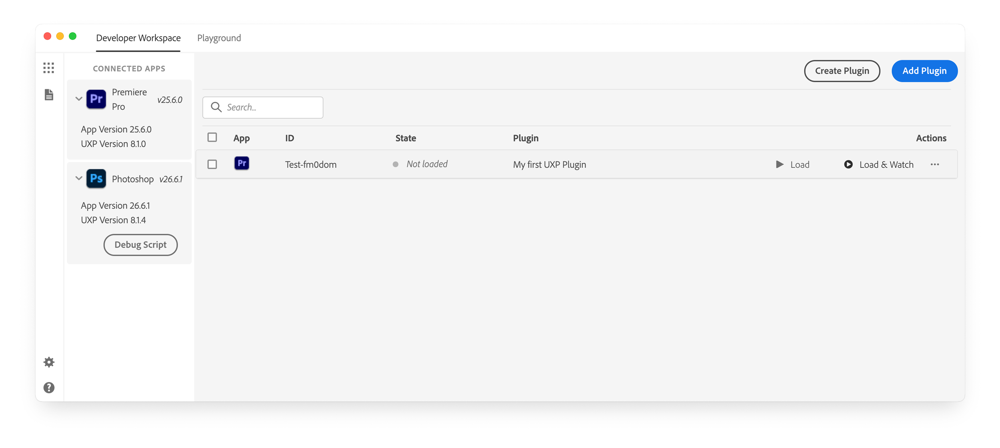
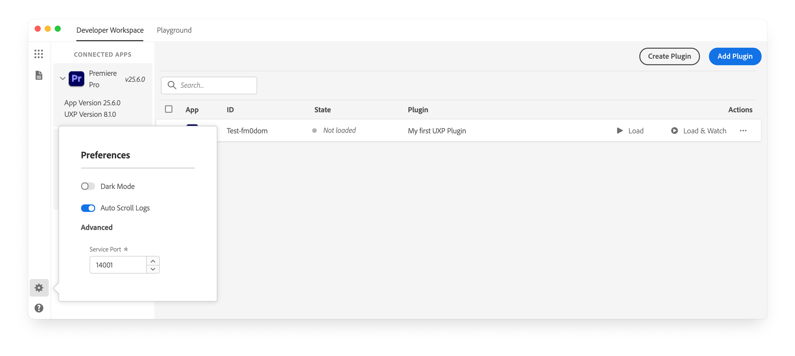
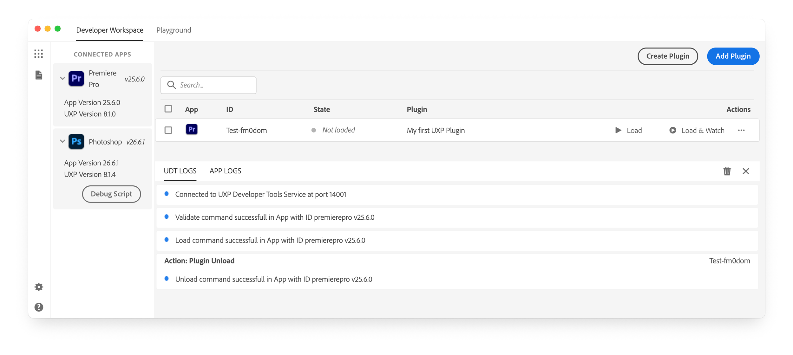

# Adobe UXP Developer Tool plugin development

Learn how to use all the Adobe UXP Developer Tool features to manage, build and test your plugins

## Prerequisites

We will assume that you have already [installed](../../../introduction/essentials/dev-tools/index.md#uxp-developer-tool-udt) the Adobe UXP Developer Tool (UDT v2.2 or later), **enabled Developer Mode in both** [UDT](../../../introduction/essentials/dev-tools/index.md#first-launch) and [Premiere Pro](../../index.md#prerequisites), and [scaffolded your first plugin](../../index.md#1-scaffold-your-plugin).

## Side panel

### Connected Applications

The left panel shows the currently opened Creative Cloud desktop applications that support UXP and are _"connected"_ to UDT. Plugins can only be loaded when the application is running; as soon as you launch it, the **Connected Apps** section will populate.

If UDT is unable to connect, please ensure that the application version actually supports UXP extensibility. If you can't see the side panel altogether, click the dots grid icon in the top-right corner to open it.

### Preferences

Click the gear icon to open the preferences panel and update the UDT **Theme** (Dark or Light), toggle **Auto Scroll Logs**, or change the **Service Port** that UDT uses to communicate with host applications.

### Logs

Click the document icon 📄 in the top-left corner to open the Logs panel. You can inspect the **UDT Logs**, where, among the rest, connection events and plugin loading status are listed, or the **App Logs**, to check for any issues in the host application.

## Read more

<DiscoverBlock slots="link, text"/>

[The Playground](playground.md)

Experiment with a sandboxed Playground environment

<DiscoverBlock slots="link, text"/>

[Plugin management](plugin-management.md)

Create or Add new plugins to your workspace

<DiscoverBlock slots="link, text"/>

[Plugin workflows](plugin-workflows.md)

Load, debug, watch your plugins into the app.
