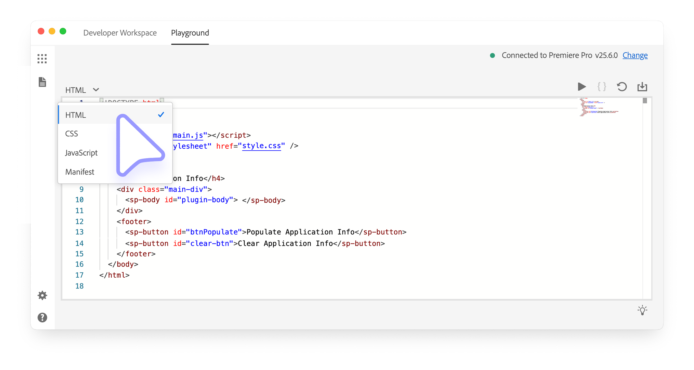
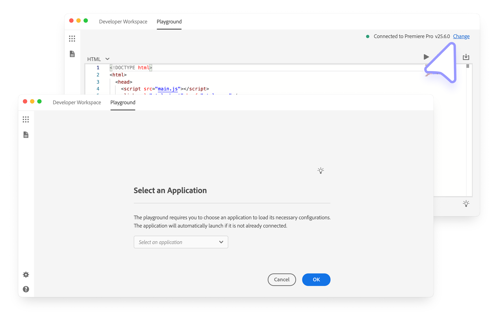
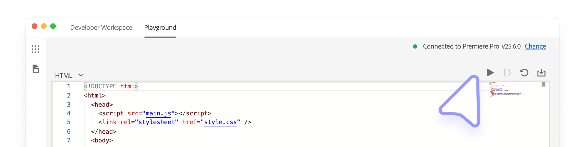
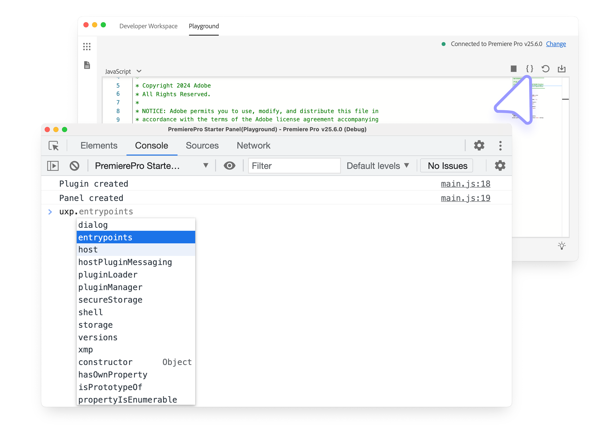
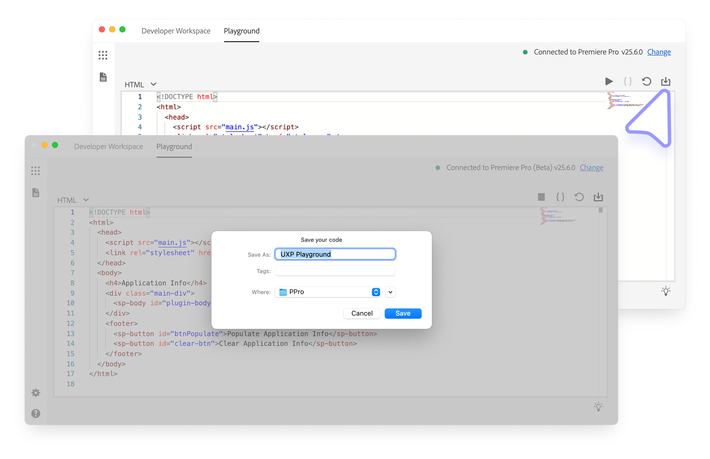

# The Playground

The Code Playground is a feature of the Adobe UXP Developer Tool that allows you to experiment with the UXP APIs in a sandboxed environment.

## Overview

The Playground provides a low-barrier entry point for plugin prototyping, allowing you to experiment and iterate on ideas directly without scaffolding any full project on disk.

## How to use the Playground

### Select the host application

Make sure you have already [connected](index.md#connected-applications) a supported application to UDT. In the top toolbar, click the **Playground** tab to open the Playground panel; it should show you a code editor:

You can click on the languages dropdown to switch between HTML, CSS, JavaScript, and Manifest editors. Make any changes you want to the code.

If you have multiple Creative Cloud applications running at the same timeand UDT has hooked the Playground to the "wrong" one, you can always change it. In the top-right corner, click the blue **Change** link to select a different one and then **OK** to confirm.

### Launch the plugin

The Playground will not automatically launch the plugin in the host application. In the top-right corner, click the blue **Play** ▶️ button to load it.

This will launch the plugin in the host application, show a green **Plugin Load Successful** message. In case of errors, a red **Plugin Load Failed** message will appear; click the **Details** link to see the error log.

### Edit and Debug the code

Whenever you edit the code in any of the tabs (HTML, CSS, and JavaScript), the Playground will automatically refresh the plugin in the host application to reflect the changes. If you want to get back to the initial state, you can click the **Reset** 🔄 button.

<InlineAlert slots="text" variant="info"/>

**Any changes to the Manifest** won't be automatically reflected in the plugin. You will need to **Unload** ⏹️ and **Load** ▶️ the plugin again.

You can **troubleshoot the plugin** by clicking the **`{}`** button to open the UDT debugger. This tool is based on the [Chrome Developer Tool](../../../introduction/essentials/tech-stack/index.md#debugging) and offers most of the same features.

### Export the code

The Playground is intended to be a prototyping tool to test APIs and iterate ideas quickly without having to scaffold a full project on disk. However, if you like how the plugin is shaping up, you can export the entire code (every file) into a folder that you can then load as a regular plugin.

In the top-right corner, click the blue **Download** ⬇️ button to open the system folder picker; select where to store the exported code and you'll get a "UXP Playground" project folder with all the files you've been working on.

