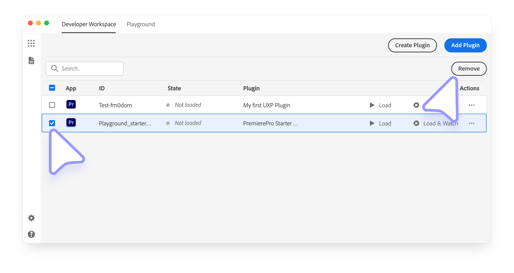

# Plugin management

The UXP Developer Tool allows you to create plugins from templates or add existing ones to your developer workspace

The UDT allows you to scaffold and import existing plugins into its workspace. You can decide to load them in the host application or keep them listed for future use.

## Create a new plugin

As we've seen in the [Getting Started guide](../../index.md#1-scaffold-your-plugin), you can create a new plugin from one of the available template provided by UDT by clicking the **Create Plugin** button. Please refer to [this section](../../index.md#1-scaffold-your-plugin) for more details.

## Add an existing plugin

If you already have a plugin project on your disk, you can add it to your workspace by clicking the **Add Plugin** button and point the file picker to the `manifest.json` file of your plugin.

Click the **Open** button to add the plugin to your workspace.

## Removing a plugin

If you're building a lot of plugins, you may find that the workspace may be getting cluttered. You can remove a plugin from the workspace by checking the plugin's associated checkbox and clicking **Remove Selected** (in the upper-right corner).

<InlineAlert variant="info" slots="text"/>

Removing a plugin from the Developer Tool's workspace **does not remove the plugin from your storage**. you can always add the plugin back later.

Once you have at least one plugin added to your workspace, let's look at the recommended [plugin development workflow](plugin-workflows.md).
