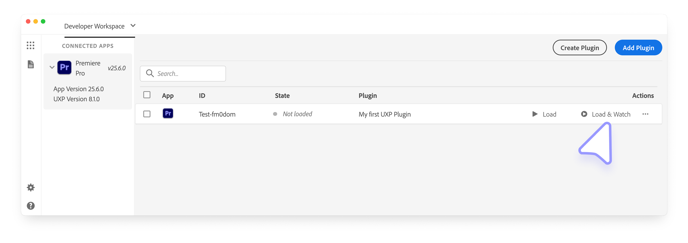

# Plugin workflows

Learn the recommended plugin development workflow for the Adobe UXP Developer Tool (UDT).

## Load and Watch a plugin

Plugins added to the developer workspace do not automatically get added to their supported host application. Instead, when the host application is launched, you should manually tell UDT to load it. You have two options here:

- **Load**: This will load the plugin in the host application.
- **Load & Watch**: This will load the plugin in the host application _and_ will watch for changes in the plugin's source code. This is the recommended option.

Plugins that load successfully will show a small green notification at the bottom of the UDT window.

If a plugin _fails_ to load, a small red notification will appear with a **Details** link; click it to open the UDT Logs panel and inspect the error.

If you have selected the **Load & Watch** option, you can also reload the plugin by clicking the **Reload** button in the UDT window.

<InlineAlert slots="header,text" variant="info"/>

Manifest changes

Load & Watch automatically reloads the plugin when you make changes to the plugin's source code with the exception of manifest changes. If you edit the `manifest.json` file, you will need to **Unload** and **Load & Watch** (or **Load**) the plugin again.

## Debug your plugin

When your plugin doesn't work as expected, you can debug it by clicking the **`{}`** link in the UDT window. This will open the UDT Debugger panel, which is based on the [Chrome Developer Tool](../../../introduction/essentials/tech-stack/index.md#debugging) and offers most of the same features.

In this debugger, you can look at the **Elements**, **Console**, **Sources**, and **Network** tabs. and do the usual debugger things such as setting breakpoints, stepping into and out of functions, walking through code, inspecting elements, and more.

It is also possible to break on start, which will cause the debugger to pause when the plugin is loaded. In UDT, open the plugin's **••• > Options...** menu, select **Advanced**, and in the next dialog, select the **Break on start** checkbox.

Once you're done with troubleshooting, you can close the debugger window.

## Working with Bundlers

When working with JavaScript frameworks like React JS, Vue, Svelte, or other bundlers like Webpack and Parcel, you'll need to understand how to effectively use them in combination with the UDT. There are various options available, depending on your workflow needs.

### Add to the UDT workspace

With bundlers, you'll typically have two `manifest.json` files. One will be in your plugin's source code directory, and the other will be in your plugin's distribution directory.

You can load either one of these, but you need to be aware of the differences.

- Adding a plugin using the **distribution** `manifest.json` means that you're loading the entire project from the distribution folder. If your plugin build steps involve removing and recreating that folder folder, or cleaning all the files it contains, your plugin _may not_ reload correctly in the UDT.
- Adding a plugin using the **source** `manifest.json` is the preferred option, but you'll also need to edit the plugin's options as follows.

In UDT, open the plugin's **••• > Options...** menu, select **Advanced**, and enter the relative path (from the selected source `manifest.json` file) to your plugin’s distribution folder. This loads the plugin the same way as in the previous step, but ensures that any build processes which remove or recreate the distribution folder won’t affect the plugin’s ability to reload in the Developer Tool.

<InlineAlert slots="text" variant="info"/>

When using a bundler or framework, **make sure to install its dependencies** by running `npm install` or `yarn install`. The UDT does not automatically install dependencies for you.

### Watch for changes

Most bundler-based projects include a dedicated build process that watches your code for changes. The UDT isn’t aware of these build steps, so if you want it to reload the plugin automatically when updates occur, you’ll need to:

- Run your plugin’s `watch` build process in a terminal
- In the Developer Tool, select **Load & Watch** for the desired plugin

This way, when your `watch` process detects a change and rebuilds the plugin, the UDT will recognize the updated build and automatically reload the plugin in the host environment.

## Package your plugin for distribution

The UDT provides a convenient way to package your plugin into a `.ccx` installer file, ready to be shared in the [Adobe Creative Cloud Marketplace](../../../resources/distribution/adobe-marketplace/index.md) or any other distribution channel of your choice. Please refer to the [Share & Distribute Guide](../../../resources/distribution/overview/index.md) for a thorough description of the subject.
