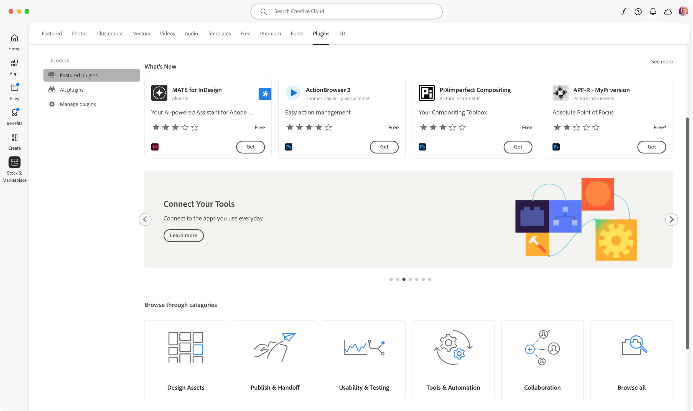

# The Adobe Creative Cloud Marketplace

The Adobe Creative Cloud Marketplace is the easiest way to distribute and monetize your plugin.

## Overview

While the UXP ecosystem allows you to share your plugin independently, you can have direct access to millions of users by distributing your products through Adobe's official Creative Cloud Marketplace.

## Features

- **Large audience** of Adobe Creative Cloud users.
- **Highly curated** by the Extensibility Review team.
- Users who have acquired your plugin will always have **access to the latest version** from their Creative Cloud account via the Creative Cloud Desktop application.
- **Integrated first-class e-commerce platform** to sell your plugin through [FastSpring](https://fastspring.com/).
  - Acts as a **Merchant of Records** (MoR)for the EU region—collecting and remitting VAT on your behalf.
  - Supports free or paid **perpetual products and subscriptions**.
  - **10% flat fee** on all transactions.
  - Sales are paid out as **Royalties** on software purchases.
- **Non-exclusive distribution channel**; you can still sell your plugin through other channels and marketplaces (see [this page](../package/index.md#mind-your-plugins-id) for more details).

In exchange for these features, you will need to submit your plugin for [review and approval](../review/index.md), as it must meet Adobe's quality standards. Once approved, your plugin will be listed in the Creative Cloud Marketplace and will be available to users.

Read more about how to [create a listing](../listing/index.md) and [review process](../review/index.md).
