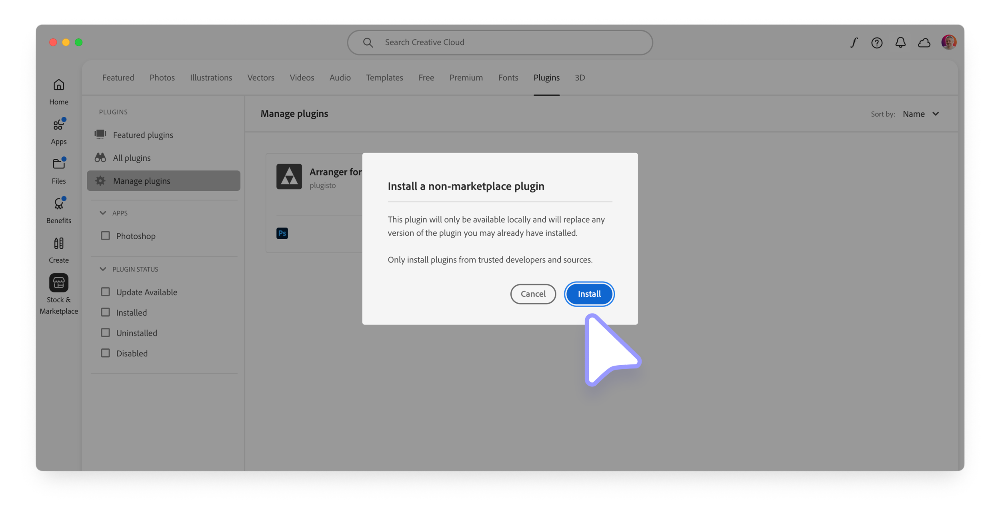
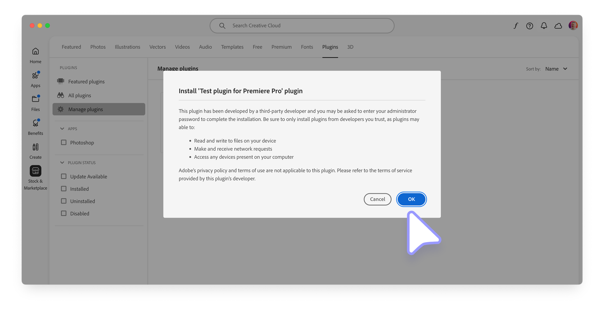

# Install a UXP plugin

UXP plugins are commonly installed directly by the Creative Cloud Desktop application.

## Overview

The installation options are slightly different depending on the distribution channel you are using—i.e., whether you are installing a plugin directly from the Creative Cloud Marketplace, a `.ccx` installer file obtained from independent channels, or deploying it in an enterprise environment.

| Distribution Channel               | Installation Method                                                                                 |
| ---------------------------------- | --------------------------------------------------------------------------------------------------- |
| **Creative Cloud Marketplace**     | Install via the [Creative Cloud Desktop application](#use-the-creative-cloud-marketplace)           |
| **Independent (`.ccx` installer)** | - [Double-click](#use-a-ccx-installer-file) on the `.ccx` file                                      |
|                                    | - Use the [UPIA tool](#use-the-upia-tool)                                                           |
| **Enterprise**                     | Use the [Admin Console](../enterprise-distribution/index.md) or the [UPIA tool](#use-the-upia-tool) |

<InlineAlert variant="info" slots="header, text"/>

Enterprise Distribution

For details on how to distribute UXP plugins in enterprise environments, please refer to the dedicated [Enterprise Distribution](../enterprise-distribution/index.md) guide.

UXP Plugins in Premiere Pro are found in the **Window** > **UXP Plugins** menu.


## Use the Creative Cloud Marketplace

UXP plugins belong to the **Stock & Marketplace** category (left-hand sidebar) in the Creative Cloud Desktop application, **Plugins** tab (top navigation). The Plugins sidebar allows you to browse a curated list of "Featured plugins" or "All plugins".

To install a plugin of your choice, click the **Get** button on the plugin card.


A confirmation dialog will appear, informing you about the permissions the plugin needs (the ones that developers have declared in the [plugin's manifest](../../../plugins/concepts/manifest/index.md#permissionsdefinition)); click **OK** to confirm the installation.


If everything goes to plan, the plugin will be available in the "Manage Plugins" section of the Creative Cloud Desktop application, as well as in the host application. For Premiere Pro, it will be the **Window** > **UXP Plugins** menu.


## Use a `.ccx` installer file

If you have developed or acquired a UXP plugin from a third-party, you can install it by **double-clicking on the `.ccx` file**. If not already open, the Creative Cloud Desktop application will launch. You will be prompted with an additional warning dialog since the plugin doesn't come from the Creative Cloud Marketplace; click on the **Install** button to continue.



Depending on the specific access level the plugin requires (for example, to the Network or the Local FileSystem—see [this section](../../../plugins/concepts/manifest/index.md#requiredpermissions) of the Manifest reference for more details), users may need to grant administrative privileges to the plugin.



Once the installation is complete, the plugin will be available in the Plugins section of the Creative Cloud Desktop application application, as well as in the host application. For Premiere Pro, it will be the **Window** > **UXP Plugins** menu.


If the installation fails, click the Details link on the red toast to open the Logs and check the error message. See [Troubleshooting](#troubleshooting) for more details.

## Uninstall a Plugin

In the Creative Cloud Desktop application, "Manage Plugins" tab, right-click on the **•••** icon within a plugin card and select **Uninstall** to delete it. There's also the option to **Disable** the plugin, which will remove it from the host application but keep it installed in the Creative Cloud Desktop application. Both actions will pop a confirmation dialog.


<InlineAlert variant="info" slots="text, text2"/>

As shown in the screenshot above, there’s a **distinction between plugins installed from the Creative Cloud Marketplace** (left) **and those installed from a `.ccx` file** (right, indicated by the orange download icon).

When you uninstall a plugin that was installed from the Marketplace, it's removed from the host application but **remains visible** in the Manage Plugins tab. This is because you still have the right to reinstall it at any time. In contrast, plugins installed from a `.ccx` file **disappear entirely** from the Manage Plugins tab once uninstalled.

## Use the UPIA tool

Under the hood, the Creative Cloud Desktop application uses a command-line utility called the **Unified Plugin Installer Agent** (UPIA) to manage UXP plugins. Please refer to the [UPIA tool documentation](https://helpx.adobe.com/creative-cloud/apps/integration-with-other-apps/manage-plugins/install-plugins-using-upia-tool.html) for a detailed usage guide for both macOS and Windows.

The UPIA tool can **install**, **uninstall**, and **list** plugins. Here's a quick summary of the available commands.

### On macOS

Open the **Terminal** and `cd` to the UPIA executable folder—admin privileges may be required:

```bash
cd "/Library/Application Support/Adobe/Adobe Desktop Common/RemoteComponents/UPI/UnifiedPluginInstallerAgent/UnifiedPluginInstallerAgent.app/Contents/macOS"

./UnifiedPluginInstallerAgent --help
./UnifiedPluginInstallerAgent --version
./UnifiedPluginInstallerAgent --install <extension-file-path>
./UnifiedPluginInstallerAgent --remove <extension-file-path>
./UnifiedPluginInstallerAgent --list <all || product display name>
```

A few examples:

```bash
./UnifiedPluginInstallerAgent --install "~/Desktop/Test-xjluvc_premierepro.ccx"
./UnifiedPluginInstallerAgent --remove "startup-test"
./UnifiedPluginInstallerAgent --list all
```

### On Windows

Open the **Command Prompt**, type this command and press Enter:

```bash
cd "C:\Program Files\Common Files\Adobe\Adobe Desktop Common\RemoteComponents\UPI\UnifiedPluginInstallerAgent"
```

Here's a list of the available commands—admin privileges may be required:

```bash
UnifiedPluginInstallerAgent.exe /help
UnifiedPluginInstallerAgent.exe /version
UnifiedPluginInstallerAgent.exe /install <extension-file-path>
UnifiedPluginInstallerAgent.exe /remove <extension-file-path>
UnifiedPluginInstallerAgent.exe /list <all || product display name>
```

A few examples:

```bash
UnifiedPluginInstallerAgent.exe /install "C:\Temp\Test-xjluvc_premierepro.ccx"
UnifiedPluginInstallerAgent.exe /remove "startup-test"
UnifiedPluginInstallerAgent.exe /list all
```

## Troubleshooting

While UXP plugins are generally very reliable in terms of management, occasional issues may arise.

- It is helpful to **run the host application at least once** before installing any plugin.
- If the Creative Cloud Desktop application is not launching when you double-click on a `.ccx` file, try locating the UPIA executable and running it manually. The **file extension may not have been associated properly**, or there might be **permission issues**.
- It may happen that the UPIA executable is either corrupted or not present in the system. **Reinstalling the Creative Cloud Desktop application** may resolve the issue. If you are installing plugins in an enterprise environment, please [check here](../enterprise-distribution/index.md#2-bundle-ccx-plugins-in-managed-packages) how to include the UPIA in your package.
- Try using [Anastasiy's Extension Manager](https://install.anastasiy.com/) (third-party tool) to install the plugin.
- Reach out to [ccintrev@adobe.com](mailto:ccintrev@adobe.com) for support. If further troubleshooting is necessary, you may be asked to run the [Log Collector tool](https://helpx.adobe.com/creative-cloud/apps/troubleshoot/diagnostics-repair-tools/run-log-collector-tool.html).
