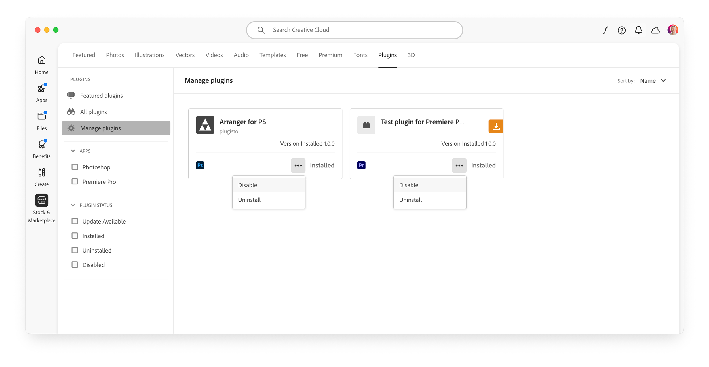

# Install a UXP plugin

UXP plugins are commonly installed directly by the Creative Cloud Desktop application.

## Use the Creative Cloud Desktop application

UXP plugins belong to the **Stock & Marketplace** category (left-hand sidebar) in the Creative Cloud Desktop application, **Plugins** tab (top navigation). The Plugins sidebar allows you to:

- Browse "Featured plugins" in the Adobe Creative Cloud Marketplace.
- See a list of "All plugins".
- "Manage plugins" you've already installed.


### Installation

To install a UXP plugin, **double-click on the `.ccx` file**. If not already open, the Creative Cloud Desktop application (CCD)will launch. You will be prompted with a warning dialog since the plugin doesn't come from the Creative Cloud Marketplace.


Click on the `Install` button to continue. Depending on the specific access level the plugin requires (for example, to the Network or the Local FileSystem—see [this section](../../../plugins/concepts/manifest/index.md#requiredpermissions) of the Manifest reference for more details), users may need to grant administrative privileges to the plugin.


Once the installation is complete, the plugin will be available in the Plugins section of the CCD application, as well as in the host application.


### Uninstall

Right-click on the `...` icon within a plugin card and select `Uninstall` to delete it from the CCD application. There's also the option to `Disable` the plugin, which will remove it from the host application but keep it installed in the CCD.



## Use the UPIA tool

Under the hood, the CCD uses a command-line utility called the **Unified Plugin Installer Agent** (UPIA) to manage UXP plugins. Please refer to the [UPIA tool documentation](https://helpx.adobe.com/creative-cloud/apps/integration-with-other-apps/manage-plugins/install-plugins-using-upia-tool.html) for a detailed usage guide for both macOS and Windows.

The UPIA tool can install, uninstall, and list plugins. Here's a quick summary of the available commands.

### On macOS

Open the **Terminal** and `cd` to the UPIA executable folder—admin privileges may be required:

```bash
cd "/Library/Application Support/Adobe/Adobe Desktop Common/RemoteComponents/UPI/UnifiedPluginInstallerAgent/UnifiedPluginInstallerAgent.app/Contents/macOS"

./UnifiedPluginInstallerAgent --help
./UnifiedPluginInstallerAgent --version
./UnifiedPluginInstallerAgent --install <extension-file-path>
./UnifiedPluginInstallerAgent --remove <extension-file-path>
./UnifiedPluginInstallerAgent --list <all || product display name>
```

A few examples:

```bash
./UnifiedPluginInstallerAgent --install "~/Desktop/Test-xjluvc_premierepro.ccx"
./UnifiedPluginInstallerAgent --remove "startup-test"
./UnifiedPluginInstallerAgent --list all
```

### On Windows

Open the **Command Prompt**, type this command and press Enter:

```bash
cd "C:\Program Files\Common Files\Adobe\Adobe Desktop Common\RemoteComponents\UPI\UnifiedPluginInstallerAgent"
```

Here's a list of the available commands—admin privileges may be required:

```bash
UnifiedPluginInstallerAgent.exe /help
UnifiedPluginInstallerAgent.exe /version
UnifiedPluginInstallerAgent.exe /install <extension-file-path>
UnifiedPluginInstallerAgent.exe /remove <extension-file-path>
UnifiedPluginInstallerAgent.exe /list <all || product display name>
```

A few examples:

```bash
UnifiedPluginInstallerAgent.exe /install "C:\Temp\Test-xjluvc_premierepro.ccx"
UnifiedPluginInstallerAgent.exe /remove "startup-test"
UnifiedPluginInstallerAgent.exe /list all
```

## Troubleshooting

While UXP plugins are generally very reliable in terms of management, occasional issues may arise. Most often, they are related to issues with the UPIA tool.

- If the CCD is not launching when you double-click on a `.ccx` file, try locating the UPIA executable and running it manually. The file extension may not have been associated properly.
- It may happen that the UPIA executable is either corrupted or not present in the system.

**Reinstalling the Creative Cloud Desktop application** may resolve the issue.
