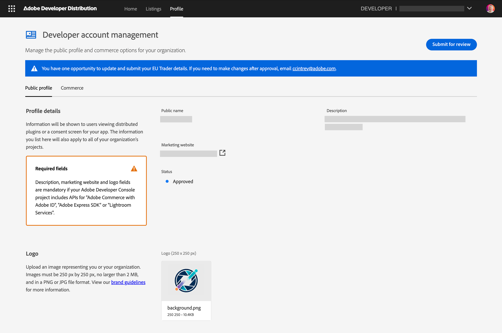
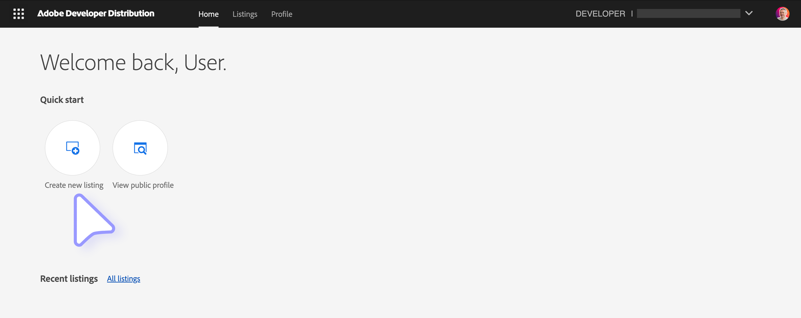
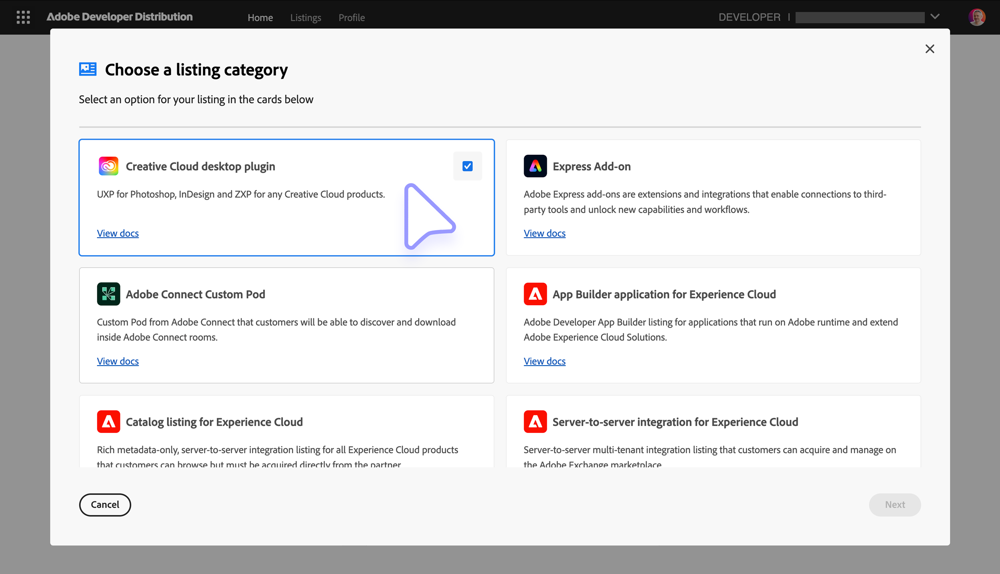
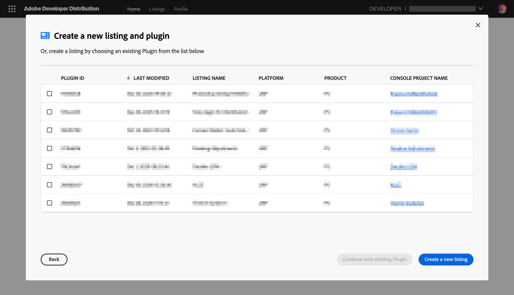
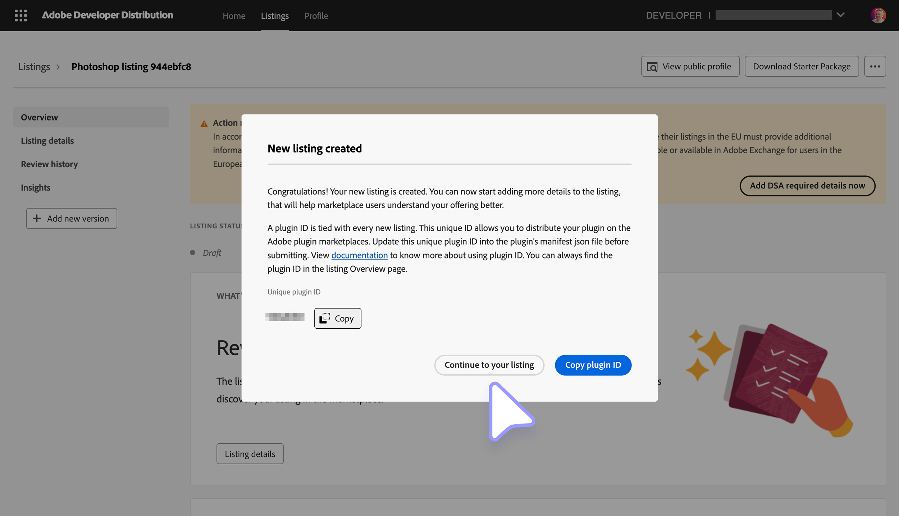
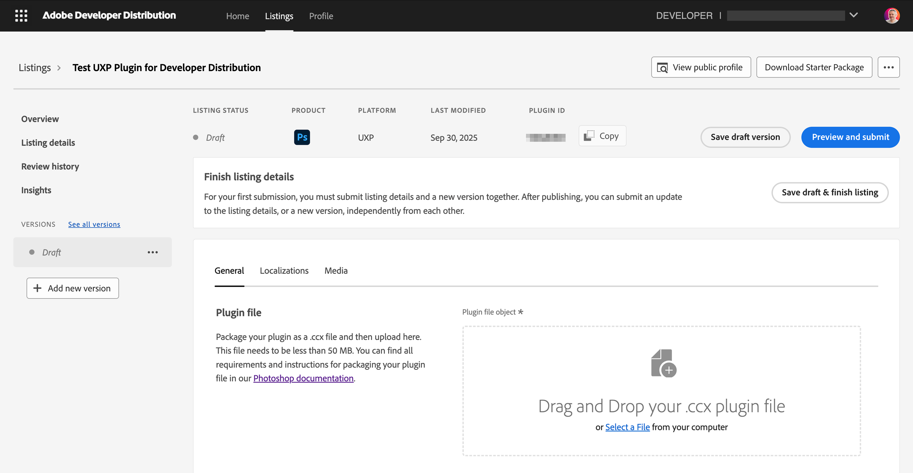

# Create a Listing

How to create and submit a listing to the Adobe Developer Distribution portal

## Overview

This guide helps you ensure your UXP plugin distribution process goes as smoothly as possible. We've provided a list of all of the things you can prepare in advance, as well as the steps to follow to submit your plugin for public distribution. Please note that public distribution is subject to a [quality review](../review/index.md) by our team according to our Guidelines.

## Preparing for Submission

### 1. Metadata

**\* indicate required fields.**

| Name                           | Character Length |                                                                                                  Description |
| ------------------------------ | ---------------- | -----------------------------------------------------------------------------------------------------------: |
| **\* Public plugin name**      | 45               |                                                                                 A unique name for the plugin |
| **\* Subtitle**                | 30               |                                                       A subtitle that will appear in the plugin listing card |
| **\* Description**             | 5000             |                                                A full context and description of the plugin and its features |
| **\* Categories**              | NA               |                     Collaboration, Tools & Automation, Usability & Testing, Publish & Handoff, Design Assets |
| **Tags**                       | 300              |                                                              Tags to increase discoverability of the listing |
| **\* Support email**           | 1000             |                                                           Support email address to be shared with your users |
| **Help URL**                   | 1000             |                                                                               URL for your users to get help |
| **Privacy Policy URL**         | 1000             |                                                                                   URL of your Privacy Policy |
| **Terms of Service URL**       | 1000             |                                                                                 URL of your Terms of Service |
| **Purchase Method**            | NA               |                                                                      Either Free, Perpetual, or Subscription |
| **\* Trader information**      | NA               | Provide the Trader information in the Publisher Profile if you want to make your plugins available in the EU |
| **\* Version details**         | 1000             |                                                                                         Public release notes |
| **\* Supported Languages**     | 1000             |                                                                            Languages supported by the plugin |
| **\* Note do Adobe Reviewers** | 1000             |                                                                                     Note for Adobe Reviewers |

Please ensure that all required fields are filled out with proper values and that the information is accurate.

<InlineAlert slots="header, text" variant="info"/>

Testing credentials

Don't forget to provide testing credentials for paid/premium functionality if your plugin needs them. Our reviewers must be able to access all the features as part of the testing routine. Failing to supply these credentials will result in the immediate rejection of your submission.

### 2. Assets

| Type                       | Format           |                                                   Description |
| -------------------------- | ---------------- | ------------------------------------------------------------: |
| **\* 48x48 icon**          | `.jpg/png` < 1MB |                        a 48x48 sized icon for the plugin card |
| **\* 96x96 icon**          | `.jpg/png` < 1MB |                        a 96x96 sized icon for the plugin card |
| **\* 192x192 icon**        | `.jpg/png` < 1MB |                      a 192x192 sized icon for the plugin card |
| **\* Screenshot**          | `.jpg/png` < 5MB |       a 1360x800 sized screenshot for the plugin listing page |
| **Additional screenshots** | `.jpg/png` < 5MB |                    4 more optional 1360x800 sized screenshots |
| **Videos**                 | URL              | Up to 5 YouTube or Vimeo video URLs with captions (255 chars) |
| **\* Publisher logo**      | `.jpg/png` < 2MB |           250x250 sized logo to represent you or your company |

<InlineAlert slots="text" variant="info"/>

A **publisher logo** is only required the first time you submit for distribution, and if you've never created a publisher profile.

### 3. Plugin Package

Follow the instructions in [Package a UXP plugin](../package/index.md) to create a `.ccx` package file. Make sure to review the [plugin's ID](../package/index.md#mind-your-plugins-id) recommendations.

## Submission Steps

### 1. Public Profile

Before you can submit your plugin for public distribution, you need to create a public profile. You can do this by going to the [Developer Distribution portal](https://developer.adobe.com/distribute/home)—please read its [documentation](https://developer.adobe.com/developer-distribution/creative-cloud/docs/guides/getting-started) and follow the instructions. This is **only required the first time you submit for distribution**, and if you've never created a publisher profile before.

<InlineAlert slots="text1, text2" variant="error"/>

In case you see a **Permission Required error** message when loading the Developer Distribution portal, most likely you are accessing it from an enterprise account that doesn't have the required permissions. Please contact the administrator of your company's Admin Console to grant your user the **Developer role**, or log in with your personal Adobe ID.

In the Publisher Profile page, you'll need to provide the **Public name**, **Marketing website**, **Description**, and a **Publisher logo**. Make sure to adhere to the [branding guidelines](../review/index.md#branding-guidelines) for this information.

<InlineAlert slots="header, text1, text2" variant="info"/>

EU Digital Services Act (DSA) Trader Requirements

If you want your listing to be available in the EU region, you'll need to provide the **Trader information** as well. See the [EU Digital Services Act Trader Requirements](https://developer.adobe.com/compliance/) for more information.

If you do not wish to provide such information, your listing will be automatically hidden to users in Europe—who won't be able to purchase your plugin—while the rest of the world will still have access to it.

In the **Commerce** tab of the Publisher Profile page, you'll be asked to register with Adobe's third-party payment provider, [FastSpring](https://fastspring.com/), and enter your **FastSpring key**. This will allow the Creative Cloud Marketplace to pay for your plugin's sales and transfer the royalties to your FastSpring account.

### 2. Create a New Listing

In the [Developer Distribution portal](https://developer.adobe.com/developer-distribution/creative-cloud/docs/guides/getting-started), click on **Create New Listing**.

Among the available options, select **Creative Cloud desktop plugin** and click on Next.

You'll be presented with Product cards for each Creative Cloud application that supports UXP. Select the one you want to submit your plugin for and click on **Next**.

If you already have published or draft listings, you can select them from the dropdown menu and click on **Continue with existing Plugin**; otherwise, click on **Create a new listing**.

The new listing is created, and the **plugin ID** is automatically generated. **Copy** and store this ID, as you'll need it to package your plugin. Click on **Continue to your listing**.

### 3. Plugin Details

Click on the **Listing Details** and start filling in the required fields in the **General**, **Localizations**, **Media**, **Tags** and **Services** sections with the appropriate values that you've collected in the [Preparing for Submission](#preparing-for-submission) section.

When you're done, click on **Save draft & add version**.

### 4. Add a new Version

For every plugin version you submit (including the first one), you have to upload the `.ccx` package file prepared earlier.

Fill in the required fields (Supported languages, Version details, Screenshots...) in all the tabs. For your first submission, you must submit listing details and a new version together; after publishing, you can submit an update to the listing details, or a new version, independently from each other.

When you're done, click on **Submit for review**. You'll be presented with a summary of the information you've provided. Add a note for the reviewers, including any testing credentials if they need them, and preview the listing details in the Creative Cloud Marketplace to make sure everything looks good.

You have the option to have your plugin automatically published after the review process is complete, or manually publish it later.

Click on **Submit listing** to finally submit your plugin for review. We aim to review your plugin within **10 business days** of submission and will notify you whether it has been accepted or requires changes. Check the [Review process](../review/index.md) page for more details.
