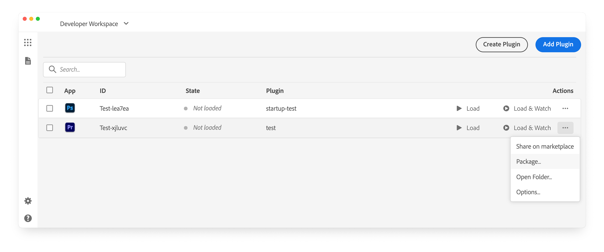
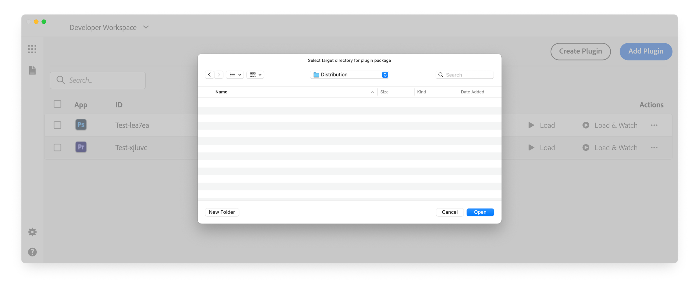
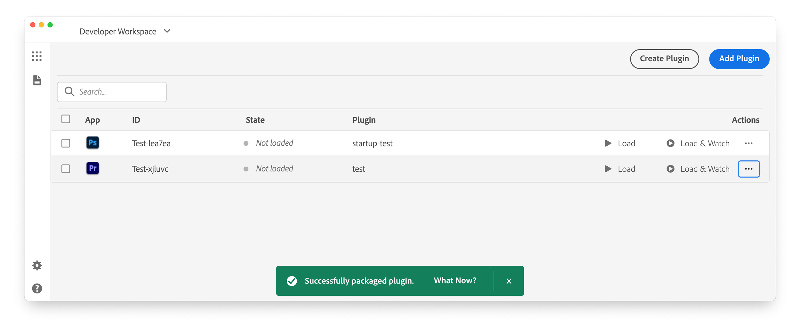
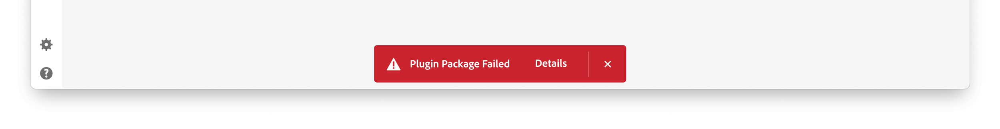

# Package a UXP plugin

UXP plugins are packaged as `.ccx` files, which can be shared privately or published to the Creative Cloud Marketplace.

## The CCX file format

A `.ccx` file is a regular ZIP file under the hood. Unless you have some special requirements, we suggest **not to create it manually** and let the UXP Developer Tool do it for you instead—as we will see later in this guide.

### Differences with CEP Extensions

Compared to CEP extensions which relied on `.zxp` files, the UXP ecosystem simplifies the packaging and distribution process in different ways. Most notably, you **no longer need to apply a Digital Signature and Timestamp the package**.

The new `.ccx` format is **installed directly by the Creative Cloud Desktop application**, which has proved to be more reliable than the `ExManCmd` utility—easier for the final users to install, and less error prone.

Finally, UXP doesn't support the use of `MXI` files for advanced packaging configuration anymore.

## Mind your Plugin's ID

Before you package your plugin for distribution, make sure that the `manifest.json` file contains a valid `id` string property. The ID must be a **unique identifier for your plugin** and it is used to disambiguate plugins when installing them.

If you plan to **publish to the Adobe Creative Cloud Marketplace**, you should obtain the ID string from the [Developer Distribution portal](https://developer.adobe.com/developer-distribution/creative-cloud/docs/guides/plugin-id#starting-from-adobe-developer-distribution) while creating a new UXP plugin listing. It is particularly important that the IDs in the `manifest.json` and Developer Distribution portal match, or the plugin will not pass the validation step.

### Multi-channel distribution

If you plan to distribute your plugin through any channels—either marketplaces or direct distribution—that _also include_ the Creative Cloud Marketplace, you should **use two different IDs**: one exclusively for the Creative Cloud Marketplace and one for the other channels.

This is particularly important for paid plugins. When a user attempts to install a plugin purchased from a third-party marketplace, the Creative Cloud Desktop application will **validate the plugin's ID against their Adobe ID**. When the plugin'sID matches only the Marketplace distribution, the installation will be rejected because the purchase cannot be verified.

- ❌ **With the same ID for all distribution channels** (including the Creative Cloud Marketplace):

  1. A user purchases a UXP plugin from a third-party marketplace.
  2. The Creative Cloud Desktop (CCD) application is in charge of the installation process and checks whether the plugin is available in the Creative Cloud Marketplace.
  3. If the plugin is indeed listed in Adobe's Marketplace, the CCD application will check whether the current user (their Adobe ID) has purchased the plugin there.
  4. Since the purchase hasn't happened on Adobe's Marketplace, the user isn't entitled to access the plugin—hence the installation fails.

- ✅ **With a different ID for the Creative Cloud Marketplace**:
  1.  A user purchases a UXP plugin from a third-party marketplace.
  2.  The Creative Cloud Desktop (CCD) application is in charge of the installation process and checks whether the plugin is available in the Creative Cloud Marketplace.
  3.  The plugin is not available in the Creative Cloud Marketplace; no user's entitlement check is performed, and the plugin can be successfully installed.

## Package with the UXP Developer Tool

Open the UXP Developer Tool and make sure the plugin you intend to package is listed in the workspace—it doesn't need to be loaded in the host application.

Click on the `...` icon to open the flyout menu and select `Package`.

This will open a dialog where you can select the folder where the package will be stored.

If everything goes to plan, the package will be created and named after the plugin's ID, e.g., `Test-xjluvc_premierepro.ccx`.

A green toast notification will appear to confirm the success of the operation. If this is not the case, click the Details link on the red toast to open the Logs and check the error message

Before distributing your package, test the installation to confirm it works as expected.
