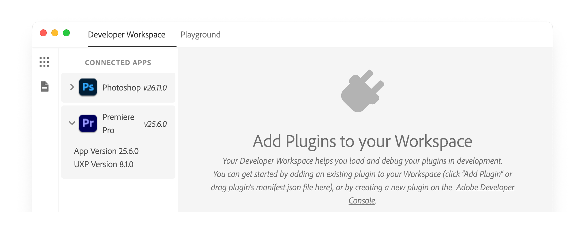

# Understanding UXP APIs

Learn about the two types of APIs available in UXP and when to use each one

## Overview

Now that you have successfully built your first [plugin](../../../plugins/index.md), you're ready to tackle more complex tasks. The key to building useful plugins is understanding which APIs to use and when.

The UXP platform provides two complementary sets of APIs:

1. **UXP Core APIs**: for building user interfaces, file operations, network calls, and general functionality.
2. **Premiere Pro APIs**: for interacting with and modifying Premiere Pro projects and sequences.

Most often than not, you will need to use both APIs together to create the functionality you want. Let's explore each one and see how they work.

## UXP Core APIs

UXP Core APIs provide the fundamental building blocks for your plugin's functionality, and are **shared** across all Adobe Creative Cloud applications that support UXP. These APIs let you:

- **Create user interfaces** using HTML, CSS, and JavaScript
- **Access the file system** to read and write files
- **Make network requests** to communicate with external services
- **Handle clipboard operations** for copy/paste functionality
- **Work with system utilities** like shell commands and OS information

### Accessing UXP APIs

The way you access UXP APIs depends on the specific API itself:

**Global APIs** are available immediately without any import. For example:

```javascript
// Crypto API is globally available
const hash = crypto.randomUUID();

// Document API is globally available
const button = document.createElement("sp-button");
```

**Module-based APIs** require importing with `require()`. For example:

```javascript
// Parent UXP module
const uxp = require("uxp");

// File system access
const fs = require("fs");

// Operating system utilities
const os = require("os");
```

**Permission-based APIs** also need to be allow-listed in your plugin's `manifest.json`. For example, to use the file system or make network requests, you must declare the appropriate permissions. Learn more about permissions in the [Manifest guide](../../../plugins/concepts/manifest/index.md#requiredpermissions).

## Premiere Pro APIs

Premiere Pro APIs, also interchangeably called **DOM APIs** (Document Object Model) or **Premiere Pro DOM APIs**, give you direct access to Premiere Pro's document model. These APIs let you, among other things, to:

- **Access and modify projects** — sequences, tracks, clips, and markers
- **Work with media** — import files, manage project items
- **Control playback** — set in/out points, control the playhead
- **Apply effects** — add video and audio effects to clips
- **Export content** — configure and trigger exports

The entry point to Premiere Pro APIs is the `app` object, that you `require()` from the `"premierepro"` module.

```javascript
const app = require("premierepro");
```

You'll learn how to access and use Premiere Pro APIs in the [Working with Premiere Pro APIs](../dom-apis/index.md) section and by browsing the [Premiere Pro API reference](../../../ppro_reference/index.md).

<InlineAlert variant="warning" slots="header, text" />

Don't confuse the two DOMs

The **Premiere Pro DOM** controls the Premiere Pro document (projects, sequences, clips). The **HTML DOM** controls your plugin's user interface (buttons, inputs, panels). They are completely separate systems.

### Unified JavaScript Engine

As the platform's name [suggests](../../../index.md), UXP provides a _unified_ JavaScript engine that has **direct access to both the Premiere Pro APIs and the UXP Core APIs**. This is a big advantage over the previous extensibility technology (CEP), where the communication between the extension logic and the host application happened through a bridge (CSInterface) that passed messages back and forth between the two runtimes.

With UXP, everything runs natively in the same environment, and you just need to `require()` the appropriate modules to access the APIs you need.

## Practical Example

Let's see how both API types work together. Imagine you want to build a plugin that:

1. Reads text content from a file on the user's computer
2. Creates a new text layer in the active sequence
3. Applies a specific style to the text layer

Here's which APIs you would use for each step:

**Step 1: Read file content** — Use UXP's `fs` module

```javascript
const fs = require("fs");
const file = await fs.getFileForOpening();
const content = await file.read();
```

**Step 2: Create text layer** — Use Premiere Pro APIs

```javascript
const app = require("premierepro");
const sequence = app.project.activeSequence;
// Add text layer to sequence
```

**Step 3: Apply styling** — Use both APIs

```javascript
// Premiere Pro APIs to modify the clip properties
// UXP APIs to show progress in your plugin's UI
```

This demonstrates how UXP Core APIs handle the infrastructure, while Premiere Pro APIs handle the creative content manipulation.

## API Versioning and Compatibility

Both UXP and Premiere Pro APIs are actively evolving, with new capabilities added in each release. It's important to understand how versioning works to ensure your plugin functions correctly.

### Host Application and UXP

- **Premiere Pro version** (v25.6): determines which Premiere Pro DOM APIs are available.
- **UXP version** (v8.1): determines which UXP Core APIs are available.

Each Premiere Pro release integrates a specific UXP version. For example, Premiere Pro v25.6 includes UXP v8.1.

<InlineAlert variant="info" slots="header, text, text2" />

Handling Version Mismatches

If your plugin relies on an API introduced in UXP v8.2, but the user is running Premiere Pro v25.6 (which only includes UXP v8.1), it will throw errors and fail to run. The same applies if your plugin depends on APIs added in Premiere Pro v25.7 but the user is still on v25.6.

To avoid compatibility issues, make sure to target APIs common to both versions, or implement fallback logic for older releases when possible.

### Checking Versions

You can determine the UXP version in several ways:

#### 1. In the UXP Developer Tool

Once Premiere Pro is running and appears under "Connected apps", you'll see both the Premiere Pro version and UXP version displayed.



If you only see the host application version (as in the case of Photoshop in the screenshot above), please click the arrow next to the product icon to expand the details.

#### 2. Programmatically in your plugin

```javascript
const { host, version } = require("uxp");
console.log(`Premiere Pro ${host.version}`); // Premiere Pro 25.6.0
console.log(`UXP ${versions.uxp}`);          // UXP uxp-8.1.0-local
```

See the [host info recipe](../../recipes/host-info/index.md) for a complete example.

#### 3. In the documentation

The [What's new](../../../changelog/index.md) section lists the UXP version for each Premiere Pro release, along with all new features, changes, and fixes.

## Next Steps

Now that you understand the two types of APIs available, you're ready to:

- Explore practical [code recipes](../../recipes/) that demonstrate common tasks
- Learn how to [work with Premiere Pro APIs](../dom-apis/index.md) in depth
- Browse the complete [UXP API reference](../../../uxp-api/) and [Premiere Pro API reference](../../../ppro_reference/)
