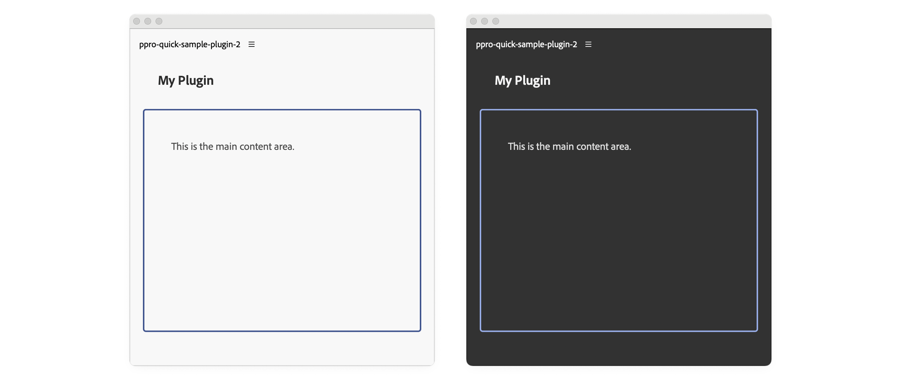

# CSS Styling

Style your plugin's user interface using CSS classes, inline styles, or JavaScript

UXP supports standard CSS for styling your plugin's interface. You can apply styles using **CSS classes**, **inline styles**, or **JavaScript**—choose the approach that fits your workflow best.

## Prerequisites

Before you begin, make sure your development environment uses the following versions:

- **Premiere Pro v25.6** or higher
- **UDT v2.2** or higher
- **Manifest version v5** or higher

## Overview

If you're new to UXP plugin development or coming from a native extension background, this section provides a quick reference for the three standard approaches to applying styles in UXP. While these methods mirror standard web development practices, it's worth noting how they work in the UXP context before exploring more advanced patterns like theme awareness.

<CodeBlock slots="heading, code" repeat="3" languages="HTML, JavaScript, CSS" />

#### index.html

```html
<!-- 1. Using CSS classes -->
<div class="green-background">
  <h1>Styled with CSS class</h1>
</div>

<!-- 2. Using inline styles -->
<div style="background-color: yellow;">
  <h1>Styled inline</h1>
</div>

<!-- 3. Using JavaScript -->
<div id="exampleDiv">
  <h1>Styled with JavaScript</h1>
</div>
```

#### index.js

```js
// Apply styles via JavaScript
const exampleDiv = document.getElementById("exampleDiv");
exampleDiv.style.backgroundColor = "orange";
```

#### styles.css

```css
/* Define styles in a stylesheet */
.green-background {
  background-color: green;
}
```

## Theme Awareness

Premiere Pro supports theme awareness, which means that your plugin's UI can adapt to the user's chosen application theme—either, **Light**, **Dark**, or **Darkest**. In Premiere Pro UXP plugins, the `document` object implements a `theme` property with a `getCurrent()` method that returns the current theme as a string.

Additionally, `theme` implements a `onUpdated` event listener that is triggered when the user manually changes it. Its callback can then update your plugin's UI with custom CSS classes to match the new theme.

### Example: Change styles on the fly

<CodeBlock slots="heading, code" repeat="2" languages="HTML, JavaScript" />

#### index.html

```html
<body>
  <h4 id="plugin-heading">Application Info</h4>
  <div class="main-div">
    <div id="plugin-body"> </div>
  </div>
  <footer>
    <button id="btnPopulate">Populate Application Info</button>
    <button id="clear-btn">Clear Application Info</button>
  </footer>
</body>
```

#### index.js

```javascript
function updateTheme(theme) {
  panelBody = document.getElementById("plugin-body");
  panelHeading = document.getElementById("plugin-heading");

  // Change styles based on the new theme on the fly
  if(theme.includes("dark")) {
    panelBody.style.color = "#fff";
    panelHeading.style.color = "#fff";
  } else {
    panelBody.style.color = "#000";
    panelHeading.style.color = "#000";
  }
}

// Listen for theme changes
document.theme.onUpdated.addListener((theme) => {
	updateTheme(theme);
})

// Apply initial theme on load
const currentTheme = document.theme.getCurrent();
updateTheme(currentTheme);
```

### Example: Switch theme Classes

This example demonstrates how to use CSS custom properties (variables) to handle theme changes efficiently. The `updateTheme()` function applies a single theme class (`theme-light` or `theme-dark`) to the `body` element. When the theme changes, it removes the existing theme class and adds the appropriate one.

This approach leverages CSS cascade to update your entire plugin. In `styles.css`, you define CSS variables at the theme level—for example, `--heading-color`, `--body-color`, and `--border-color`. These variables are then referenced throughout the stylesheet using `var(...)`. When you change the theme class on the `body` element, all elements automatically inherit the correct colors without requiring individual updates.

<CodeBlock slots="heading, code" repeat="3" languages="HTML, JavaScript, CSS" />

#### index.html

```html
<body>
  <sp-heading>My Plugin</sp-heading>
  <div class="plugin-body">
    <sp-body>This is the main content area.</sp-body>
  </div>
</body>
```

#### index.js

```javascript
function updateTheme(theme) {
  // Apply theme to body element only - CSS variables will handle the rest
  document.body.classList.remove("theme-light", "theme-dark");
  document.body.classList.add(
    theme.includes("dark") ? "theme-dark" : "theme-light"
  );
}

// Listen for theme changes
document.theme.onUpdated.addListener((theme) => {
  updateTheme(theme);
});

// Apply initial theme on load
const currentTheme = document.theme.getCurrent(); // Returns "light", "dark", or "darkest"
updateTheme(currentTheme);

```

#### styles.css

```css
/* Theme CSS Variables */
body.theme-light {
  --heading-color: #2c2c2c;
  --body-color: #4a4a4a;
  --border-color: #40548e;
}

body.theme-dark {
  --heading-color: #f5f5f5;
  --body-color: #e0e0e0;
  --border-color: #97ace6;
}

body {
  padding: 0 16px;
}

.plugin-body {
  margin-top: 5px;
  padding: 16px;
  overflow: scroll;
  height: 300px;
  border-radius: 4px;
  border: 2px solid var(--border-color);
}

sp-heading {
  padding: 16px 20px;
  margin: 0 0 12px 0;
  font-size: 18px;
  color: var(--heading-color);
}

sp-body {
  padding: 20px;
  margin: 0;
  line-height: 1.6;
  font-size: 14px;
  color: var(--body-color);
}
```



### UXP CSS Variables

Spectrum CSS variables that are [available in other Creative Cloud applications](https://developer.adobe.com/photoshop/uxp/2022/guides/theme-awareness/#built-in-theme-colors) (for example, `--uxp-host-text-color`) are **not yet supported** in Premiere Pro. They will be added in a future release.

## Important Considerations

<InlineAlert variant="warning" slots="header, text"/>

UXP is not a browser

UXP does not support all CSS properties. For example, CSS Grid Layout is not available. Check the [CSS reference](../../../uxp-api/reference-css/) for a complete list of supported properties.

### CSS Preprocessors

UXP only understands standard CSS. If you want to use preprocessors like **Sass** or **SCSS**, you must transpile them to CSS before bundling your plugin. This requires build tools like Webpack and a slightly different [debugging workflow](../../../plugins/tutorials/udt-deep-dive/plugin-workflows.md#working-with-bundlers).

### Use Spectrum for Consistency

We recommend using [Spectrum](../../fundamentals/user-interfaces/index.md#spectrum-web-components-swc) for UI elements whenever possible. Spectrum is Adobe's design system and provides a consistent look and feel across all Adobe applications.

## Reference Material

- [CSS Reference](../../../uxp-api/reference-css/index.md): complete list of supported CSS properties.
- [Spectrum Web Components](../../../uxp-api/reference-spectrum/index.md) Reference.
