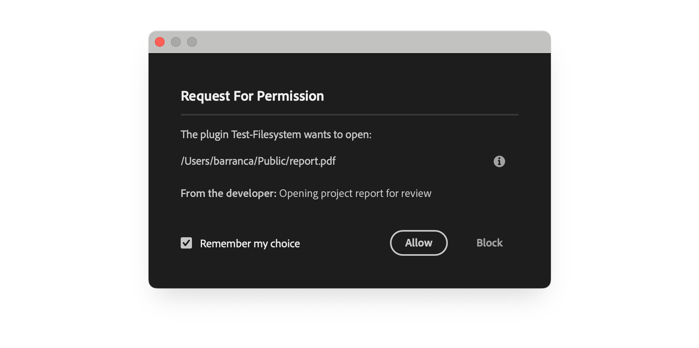
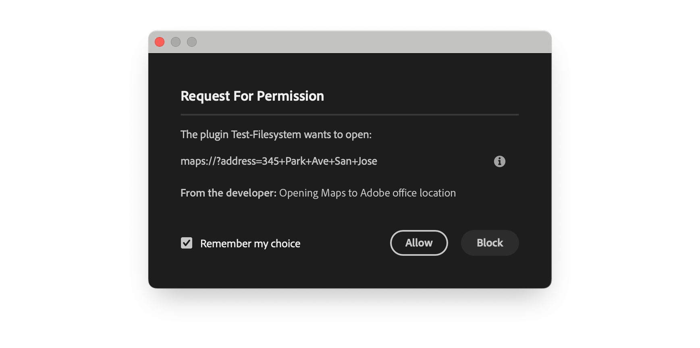

# Launch External Processes

Open files and launch applications from your plugin to extend workflows beyond Premiere Pro

UXP provides the [`shell` API](../../../uxp-api/reference-js/Modules/uxp/shell/Shell.md) to let your plugin interact with the user's operating system—**opening files** in their default applications and **launching external programs** via URL schemes. This is useful for workflows that span across multiple tools.

## System requirements

Please make make sure your development environment uses the following **minimum versions** to avoid compatibility issues:

- **Premiere Pro v25.6**
- **UDT v2.2**
- **Manifest v5**

## Launch Process Security

By default, UXP plugins can't launch external processes; this protects users from unwanted or malicious activity. If your plugin needs to open files or launch applications, **you must declare** the [`launchProcess`](../../../plugins/concepts/manifest/index.md#launchprocesspermission) permission in your `manifest.json`. It has two components:

- **Extensions**: file extensions your plugin can open, for example, `[".pdf", ".txt"]`.
- **Schemes**: URL schemes your plugin can use, for example, `["https", "mailto"]`.

```json
{
  // ...
  "requiredPermissions": {
    "launchProcess": {
      "extensions": [".pdf", ".mp4"],
      "schemes": ["https", "mailto"]
    }
  }
  // ...
}
```

<InlineAlert variant="warning" slots="header, text"/>

User consent is always required

Whenever your plugin attempts to launch an external process, **the user must provide explicit consent** through a system dialog. Always provide clear, helpful context in the `developerText` parameter to explain why the action is needed.

## Using the Shell API

The [`shell`](../../../uxp-api/reference-js/Modules/uxp/shell/Shell.md) module provides two main methods:

- **`openPath()`**: Opens a file or folder in the system's default application.
- **`openExternal()`**: Launches an application using a URL scheme.

Both methods require user consent and return a [Promise](https://developer.mozilla.org/en-US/docs/Web/JavaScript/Reference/Global_Objects/Promise) that resolves with an empty string on success or an error message on failure.

**Access the API:**

```javascript
const { shell } = require("uxp");
```

### Example: Open Files with Default Applications

Use `openPath()` to open any file on the user's system in its default application. For example, PDFs in a reader, videos in a player, or text files in an editor.

<CodeBlock slots="heading, code" repeat="2" languages="JavaScript, JSON" />

#### index.js

```js
const { shell } = require("uxp");

// Open a PDF file in the default PDF reader 📄
async function openPDFFile() {
  try {
    // For macOS
    const result = await shell.openPath(
      "/Users/user/Desktop/report.pdf", // 👈 update with your path
      "Opening project report for review"
    );
    // For Windows, use: "C:\\Users\\user\\Desktop\\report.pdf"

    if (result === "") {
      console.log("✅ File opened successfully");
    } else {
      console.error(`❌ Failed to open file: ${result}`);
    }
  } catch (err) {
    console.error("Error opening file:", err);
  }
}

// Open a folder in Finder/Explorer 📁
async function openProjectFolder() {
  // 👇 Must have an empty string "" to allow opening folders
  // in the Manifest requiredPermissions.launchProcess.extensions array
  try {
    // For macOS
    const result = await shell.openPath(
      "/Users/user/Documents/Projects",
      "Opening project folder"
    );
    // For Windows, use: "C:\\Users\\user\\Documents\\Projects"

    if (result === "") {
      console.log("✅ Folder opened successfully");
    } else {
      console.error(`❌ Failed to open folder: ${result}`);
    }
  } catch (err) {
    console.error("Error opening folder:", err);
  }
}
```

#### manifest.json

```json
{
  "manifestVersion": 5,
  // ...
  "requiredPermissions": {
    "launchProcess": {
      "extensions": [".pdf", ".txt", ".mp4", ""]
    }
  }
  // ...
}
```

A confirmation dialog will be displayed to the user, asking for permission to open the file. The choice can be remembered to avoid future requests.



<InlineAlert variant="info" slots="text, text2"/>

When using `openPath()`, you must **specify the file extensions** you intend to open in the [`launchProcess.extensions`](../../../plugins/concepts/manifest/index.md#extensions) array of the Manifest [`requiredPermissions`](../../../plugins/concepts/manifest/index.md#requiredpermissions) object. Use an **empty string** `""` to allow **opening folders** in Finder/Explorer, as in the `openProjectFolder()` function of the above example.

If you attempt to open a file with an unlisted extension, the operation will fail.

### Example: Launch Applications via URL Schemes

Use `openExternal()` to launch applications via URL schemes—open websites in browsers, compose emails, or trigger platform-specific apps like Maps.

<CodeBlock slots="heading, code" repeat="2" languages="JavaScript, JSON" />

#### index.js

```js
const { shell } = require("uxp");

// Open a website in the default browser 🌐
async function openDocumentation() {
  try {
    const result = await shell.openExternal(
      "https://developer.adobe.com/",
      "Opening Adobe Developer documentation"
    );

    if (result === "") {
      console.log("✅ Browser opened successfully");
    } else {
      console.error(`❌ Failed to open browser: ${result}`);
    }
  } catch (err) {
    console.error("Error opening browser:", err);
  }
}

// Compose an email with pre-filled content 📧
async function sendFeedbackEmail() {
  try {
    const subject = encodeURIComponent("Plugin Feedback");
    const body = encodeURIComponent("I have feedback about your plugin...");

    const result = await shell.openExternal(
      `mailto:support@example.com?subject=${subject}&body=${body}`,
      "Opening mail client to send feedback"
    );

    if (result === "") {
      console.log("✅ Mail client opened successfully");
    } else {
      console.error(`❌ Failed to open mail client: ${result}`);
    }
  } catch (err) {
    console.error("Error opening mail client:", err);
  }
}

// Open Maps to a specific location 🗺️
async function openLocationInMaps() {
  try {
    // For macOS: use maps:// scheme
    const macResult = await shell.openExternal(
      "maps://?address=345+Park+Ave+San+Jose",
      "Opening Maps to Adobe office location"
    );

    // For Windows: use bingmaps: scheme
    // const winResult = await shell.openExternal(
    //   "bingmaps:?q=345+Park+Ave+San+Jose,+95110",
    //   "Opening Maps to Adobe office location"
    // );

    if (macResult === "") {
      console.log("✅ Maps opened successfully");
    } else {
      console.error(`❌ Failed to open Maps: ${macResult}`);
    }
  } catch (err) {
    console.error("Error opening Maps:", err);
  }
}
```

#### manifest.json

```json
{
  "manifestVersion": 5,
  // ...
  "requiredPermissions": {
    "launchProcess": {
      "schemes": ["https", "mailto", "maps", "bingmaps"]
    }
  }
  // ...
}
```

`openExternal()` and `openPath()` both require the same user consent via permission confirmation dialog



<InlineAlert variant="info" slots="text"/>

The `file:/` scheme is **not allowed** with `openExternal()`. Use `openPath()` instead for opening local files.

### Platform-Specific URL Schemes

URL schemes vary between operating systems. Some schemes are platform-specific:

| Scheme      | Platform | Purpose             |
| :---------- | :------- | :------------------ |
| `https://`  | Both     | Open web browser    |
| `mailto:`   | Both     | Compose email       |
| `maps://`   | macOS    | Open Apple Maps     |
| `bingmaps:` | Windows  | Open Bing Maps      |
| `facetime:` | macOS    | Start FaceTime call |

<InlineAlert variant="warning" slots="text"/>

Always check the user's platform before using platform-specific schemes. Attempting to use `maps://` on Windows or `bingmaps:` on macOS will fail silently or display an error.

### Run CLI commands

It is possible to run CLI commands (like AppleScripts or shell scripts) directly from your plugin using `shell.openPath()`. There are known limitations with this approach; for example, it's not possible to pass any parameters, nor to capture the output of the command:

```js
const result = await shell.openPath(    // external command
  "/bin/ls",                            // ✅ will run
  "Running the ls command"              // ⚠️ result is an empty string
);

const result = await shell.openPath(    // external command + argument
  "/bin/ls -la",                        // ❌ will fail
  "Running the ls -la command"
);
```

## Best Practices

1. **Provide clear context**: The `developerText` parameter appears in the user consent dialog. Write clear, user-friendly explanations in plain language.

```javascript
// ✅ Good: Clear and specific
await shell.openExternal(
  "https://example.com/guide",
  "Opening tutorial guide in your browser"
);

// ❌ Avoid: Vague or technical
await shell.openExternal(
  "https://example.com/guide",
  "Opening URL"
);
```

2. **Handle user denial gracefully**: Users can deny the launch request. Check the return value and provide fallback options.

```javascript
const result = await shell.openPath(
  filePath,
  "Opening project file"
);
if (result !== "") {
  // User denied or operation failed
  console.log("Unable to open file. Please open it manually.");
}
```

3. **Check platform compatibility**: Use platform detection for platform-specific schemes.

```javascript
const isMac = require("os").platform() === "darwin";
const scheme = isMac ? "maps://" : "bingmaps:";
```

4. **Encode URL parameters**: When building URLs with query parameters, always encode special characters.

```javascript
const subject = encodeURIComponent("My Subject");
const url = `mailto:user@example.com?subject=${subject}`;
```

5. **Declare all schemes and extensions**: Only list the schemes and extensions your plugin actually uses—don't request unnecessary permissions.

## Troubleshoot Common Issues

| Symptom                              | Likely Cause           | Solution                                                              |
| :----------------------------------- | :--------------------- | :-------------------------------------------------------------------- |
| Permission denied error              | Missing manifest entry | Add the extension or scheme to `launchProcess` in manifest            |
| Operation fails silently             | User denied consent    | Check return value and handle denial gracefully                       |
| Platform-specific scheme not working | Wrong scheme for OS    | Use platform detection to choose the correct scheme                   |
| `file://` scheme doesn't work        | Wrong method used      | Use `openPath()` for local files, not `openExternal()`                |
| UWP restrictions on Windows          | System security policy | UWP apps can only access files in their sandbox on Windows Store apps |

## Reference Material

- [`shell` module](../../../uxp-api/reference-js/Modules/uxp/shell/Shell.md): complete Shell API reference.
- [Manifest Permissions](../../../plugins/concepts/manifest/index.md#permissionsdefinition): overview of all permissions.
- [`launchProcess` Permission](../../../plugins/concepts/manifest/index.md#launchprocesspermission): detailed permission documentation.

## Summary

1. **Launch Process Security**: By default, plugins cannot launch external processes. You must declare the `launchProcess` permission in `manifest.json`:

   - **`extensions`**: Array of file extensions your plugin can open (e.g., `[".pdf", ".mp4"]`). Use an empty string `""` to allow opening folders in Finder/Explorer.
   - **`schemes`**: Array of URL schemes your plugin can use (e.g., `["https", "mailto"]`).
   - User consent is **always required** for security—users see a dialog for every launch attempt unless the choice is remembered.

2. **Two Shell Methods**:

   - **`openPath(path, developerText)`**: Opens files or folders in their default system application; requires the file extension to be listed in `extensions`.
   - **`openExternal(url, developerText)`**: Launches applications via URL schemes; requires the scheme to be listed in `schemes`; cannot use `file://` (use `openPath()` instead).

3. **User Experience Best Practices**:
   - URL schemes are operating system-specific: use `require("os").platform()` to check the operating system and use the appropriate scheme.
   - Provide clear, user-friendly text in the `developerText` parameter to explain why the action is needed.
   - Handle user denial gracefully by checking return values and offering fallback options.
   - Only declare schemes and extensions your plugin actually uses—avoid requesting unnecessary permissions.
   - Encode URL parameters with `encodeURIComponent()` to handle special characters properly.
