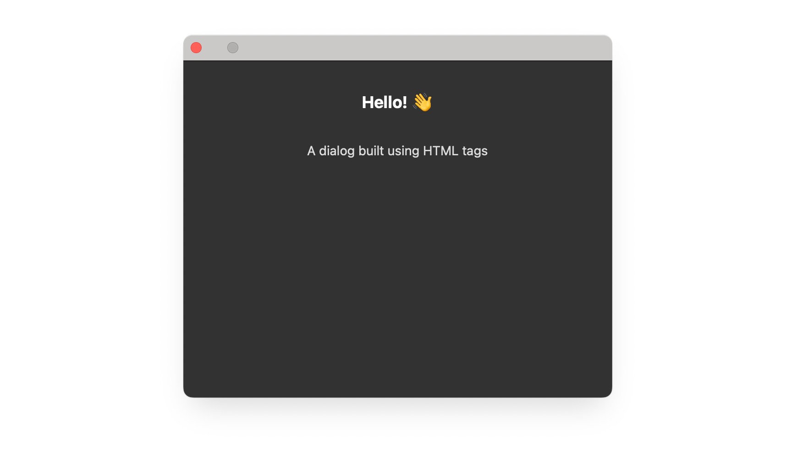
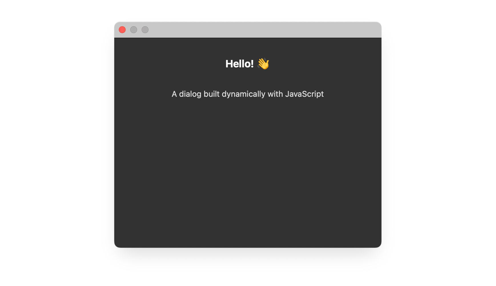

# Creating HTML Elements

Build user interfaces using HTML markup or JavaScript DOM methods

UXP lets you create UI elements in two ways: **define them in HTML** or **create them dynamically with JavaScript**. Both approaches work for Panel plugins, while Command plugins can only create modal dialogs using JavaScript.

## Prerequisites

Before you begin, make sure your development environment uses the following versions:

- **Premiere Pro v25.6** or higher
- **UDT v2.2** or higher
- **Manifest version v5** or higher

## Example: Using HTML Markup

Define your UI structure in HTML, then control it with JavaScript.

<CodeBlock slots="heading, code" repeat="3" languages="HTML, JavaScript, CSS" />

#### index.html

```html
<button id="showDialog">Show Dialog</button>

<dialog id="sampleDialog">
  <div>
    <h1>Hello! 👋</h1>
    <p>A dialog built using HTML tags</p>
  </div>
</dialog>
```

#### index.js

```js
const showDialogBtn = document.getElementById("showDialog");
showDialogBtn.addEventListener("click", () => {
  const dialog = document.getElementById("sampleDialog");
  dialog.show();

  dialog.addEventListener("cancel", () => {
    console.log("Dialog dismissed");
  });
});
```

#### styles.css

```css
#sampleDialog > div {
  display: flex;
  flex-direction: column;
  height: 300px;
  width: 400px;
  align-items: center;
  color:#DDD;
}

h1 { color: #FFF; }

#sampleDialog > div > p {
  margin-top: 30px;
}

```



## Example: Using JavaScript Only

Create and style elements dynamically using JavaScript DOM methods.

<CodeBlock slots="heading, code" repeat="2" languages="HTML, JavaScript" />

#### index.html

```html
<!DOCTYPE html>
<html>
  <head>
    <script src="main.js"></script>
    <link rel="stylesheet" href="style.css" />
  </head>

  <body>
    <button id="showDialog">Show Dialog</button>
  </body>
</html>

```

#### index.js

```js
const showDialogBtn = document.getElementById("showDialog");
showDialogBtn.addEventListener("click", () => {
  // Create dialog element
  const dialog = document.createElement("dialog");


  // Create container
  const div = document.createElement("div");
  div.style.display = "flex";
  div.style.flexDirection = "column";
  div.style.height = "300px";
  div.style.width = "400px";
  div.style.alignItems = "center";
  div.style.color = "#DDD"; // Apply UXP host text color

  // Create header
  const header = document.createElement("h1");
  header.textContent = "Hello! 👋";
  header.style.color = "#FFF";
  div.appendChild(header);

  // Create paragraph
  const para = document.createElement("p");
  para.textContent = "A dialog built dynamically with JavaScript";
  para.style.marginTop = "30px";
  div.appendChild(para);

  // Assemble and show
  dialog.appendChild(div);
  document.body.appendChild(dialog);
  dialog.showModal();

  dialog.addEventListener("cancel", () => {
    console.log("Dialog dismissed");
  });
});
```



## Creating Spectrum Components

You can use `document.createElement()` to create Spectrum UI elements dynamically:

```js
// Create a Spectrum button
const button = document.createElement("sp-button");
button.textContent = "Click me";
button.setAttribute("variant", "cta");
document.body.appendChild(button);
```

<InlineAlert variant="info" slots="text"/>

This approach works for **Spectrum Widgets** (`sp-*` elements). For **Spectrum Web Components**, you must define them in HTML markup.

## Reference Material

- [HTMLDialogElement](../../../uxp-api/reference-js/Global%20Members/HTML%20Elements/HTMLDialogElement.md): dialog-specific properties and methods.
- [HTML Elements](../../../uxp-api/reference-js/Global%20Members/HTML%20Elements/): complete list of supported HTML elements.
- [Spectrum Web Components](../../../uxp-api/reference-spectrum/): Adobe's UI component library.
