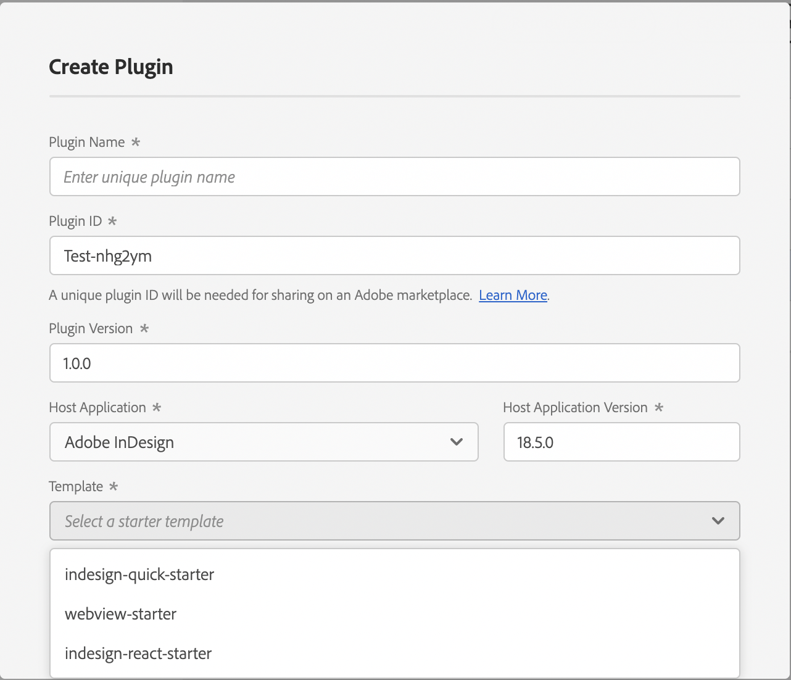

# Starters and samples

Learn from working examples and jumpstart your plugin development with sample code and starter templates.

## Overview

When building UXP plugins for Premiere Pro, you don't need to start from scratch. We provide two types of resources to help you:

- **Samples**: Complete, working examples that demonstrate specific features or use cases
- **Starters**: Minimal templates with framework setup to help you begin a new plugin project

## GitHub repository

You can find a collection of samples and starter templates in the official repository:

[UXP Premiere Pro Samples](https://github.com/AdobeDocs/uxp-premiere-pro-samples)

This repository includes:

- Working plugin examples for common tasks
- Best practices for plugin architecture
- Integration examples with Premiere Pro APIs
- Reusable code patterns you can adapt for your projects

## UDT templates

When you create a new plugin with the UXP Developer Tool (UDT), you can choose from several built-in templates:

These templates provide a ready-to-use project structure with:

- Pre-configured `manifest.json` file
- Basic HTML and JavaScript scaffolding
- Example code demonstrating key concepts
- Proper directory organization

To use a template, select it when running the `create` command in UDT. Learn more about this process in the [UDT Deep Dive tutorial](../../plugins/tutorials/udt-deep-dive/).

## Tutorials

Looking to build something from scratch? The [Tutorials section](../../plugins/tutorials/) provides step-by-step guides that walk you through complete plugin development tasks:

- [UDT Deep Dive](../../plugins/tutorials/udt-deep-dive/): Master the Adobe UXP Developer Tool
- [Add Commands](../../plugins/tutorials/add-commands/): Create menu items in Premiere Pro
- [Add Lifecycle Hooks](../../plugins/tutorials/add-lifecycle-hooks/): Respond to plugin and panel events
- [Add Multiple Panels](../../plugins/tutorials/add-panels/): Work with multiple panel entrypoints
- [Inter Plugin Communication](../../plugins/tutorials/inter-plugin-comm/): Enable plugins to communicate with each other
- [JavaScript Modules](../../plugins/tutorials/importing-modules/): Organize your code across multiple files

## Recipes

For quick, focused code examples without the full tutorial treatment, check out the [Recipes section](../recipes/). Recipes provide bite-sized, ready-to-use code snippets for common use cases:

- File system operations
- Network requests
- UI interactions
- Clipboard access
- And more

## Contributing

We'd love to expand this collection with more real-world examples. If you've built something useful, consider contributing:

1. Fork the [samples repository](https://github.com/AdobeDocs/uxp-premiere-pro-samples)
2. Add your sample with clear documentation
3. Create a pull request and tag us for review

Your contributions help the entire plugin developer community!
